# Guia do Instrutor
<em>Instructor Guide</em>

Guia completo para gerenciar sua academia de BJJ com o PGT.
<em>Complete guide to managing your BJJ academy with PGT.</em>

> [!info] Guias relacionados
> - [Guia do Aluno](./User%20Guide%20-%20Student.md)

## Primeiros Passos
<em>Getting Started</em>

### Entrar na Conta
<em>Sign In</em>

Acesse o PGT pelo navegador. A tela de login pede e-mail e senha.
<em>Open PGT in your browser. The login screen asks for email and password.</em>

1. Preencha **E-mail** e **Senha**
   <em>Fill in E-mail and Senha (password)</em>
2. Toque em **"Entrar"**
   <em>Tap "Entrar" (Sign In)</em>
3. Você é redirecionado para o Painel
   <em>You are redirected to the Dashboard</em>

Esqueceu a senha? Toque em **"Esqueceu a senha?"** na tela de login para receber um link de recuperação no seu e-mail.
<em>Forgot your password? Tap "Esqueceu a senha?" on the login screen to receive a recovery link by email.</em>

### Recuperar Senha
<em>Recover Password</em>

1. Na tela de login, toque em **"Esqueceu a senha?"**
   <em>On the login screen, tap "Esqueceu a senha?"</em>
2. Digite seu e-mail e toque em **"Enviar Link"**
   <em>Enter your email and tap "Enviar Link" (Send Link)</em>
3. Se o e-mail existir no sistema, você receberá um link de recuperação (mensagem: "Se o email existir em nossa base, enviaremos um link de recuperação.")
   <em>If the email exists in the system, you will receive a recovery link (message: "If the email exists in our database, we will send a recovery link.")</em>
4. Clique no link recebido por e-mail para abrir a página **"Redefinir Senha"**
   <em>Click the link in your email to open the "Redefinir Senha" (Reset Password) page</em>
5. Preencha **"Nova Senha"** e **"Confirmar Senha"**, depois toque em **"Redefinir"**
   <em>Fill in "Nova Senha" (New Password) and "Confirmar Senha" (Confirm Password), then tap "Redefinir" (Reset)</em>
6. Após o sucesso, toque em **"Voltar ao Login"**
   <em>After success, tap "Voltar ao Login" (Back to Login)</em>

### Criar Sua Academia
<em>Create Your Academy</em>

1. Na tela de login, clique em **"Criar Conta"**
   <em>On the login screen, click "Criar Conta" (Create Account)</em>
2. Na tela seguinte, escolha **"Criar Academia"**
   <em>On the next screen, choose "Criar Academia" (Create Academy)</em>
3. Preencha o nome da sua academia e cidade
   <em>Fill in your academy name and city</em>
4. Você se torna o instrutor e proprietário da nova academia
   <em>You become the instructor and owner of the new academy</em>

### Definir a Localização da Academia
<em>Set Your Gym Location</em>

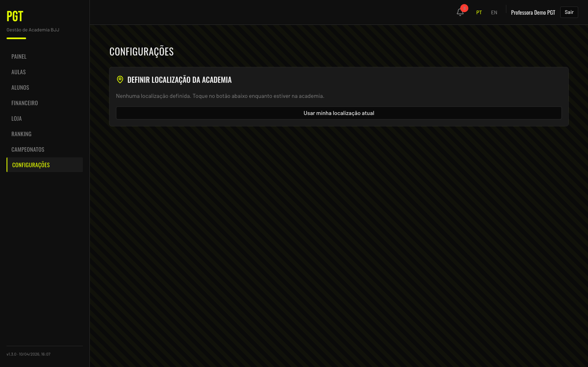

Isso é necessário para que os check-ins por proximidade funcionem.
<em>This is required for proximity-based check-ins to work.</em>

1. Menu lateral → **Configurações**
   <em>Sidebar → Configurações (Settings)</em>
2. O cartão **"Definir localização da academia"** aparece com o ícone de mapa
   <em>The "Definir localização da academia" card appears with a map pin icon</em>
3. Estando na academia, toque em **"Usar minha localização atual"**
   <em>While at the gym, tap "Usar minha localização atual" (Use my current location)</em>
4. Seu navegador solicitará permissão de localização — aprove
   <em>Your browser will ask for location permission — approve it</em>
5. As coordenadas são salvas e exibidas na tela
   <em>Coordinates are saved and displayed on screen</em>

> [!tip]
> Se aparecer a mensagem "Geolocation unavailable", o navegador bloqueou o acesso ao GPS. Verifique as permissões do site.
> <em>If you see "Geolocation unavailable", the browser blocked GPS access. Check your site permissions.</em>

### Compartilhar Seu Código de Acesso
<em>Share Your Join Code</em>

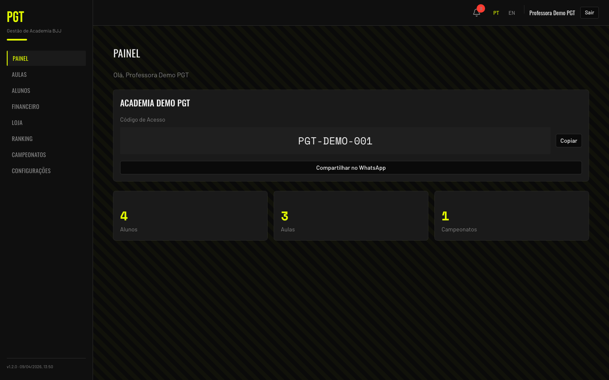

Os alunos precisam de um código de acesso para se cadastrar na sua academia.
<em>Students need a join code to register at your academy.</em>

1. Abra o **Painel** (Dashboard)
   <em>Open the Dashboard (Painel)</em>
2. O código de acesso aparece no cartão da sua academia (ex.: `PGT-PONTINHA-CM7`) abaixo do rótulo **"Codigo de Acesso"**
   <em>The join code appears in your academy card (e.g., `PGT-PONTINHA-CM7`) below the "Codigo de Acesso" label</em>
3. Toque em **"Copiar"** (alterna para **"Copiado!"** após clicar) ou **"Compartilhar no WhatsApp"** para enviá-lo
   <em>Tap "Copiar" (toggles to "Copiado!" after click) or "Compartilhar no WhatsApp" to send it</em>

## Gerenciando Alunos
<em>Managing Students</em>

### Aprovar Novos Alunos
<em>Approve New Students</em>

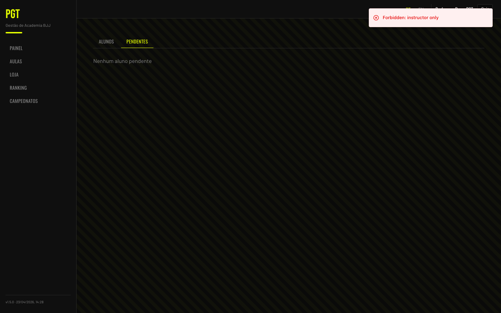

Quando um aluno entra com seu código, ele aparece como **Pendente**.
<em>When a student joins with your code, they appear as Pending.</em>

1. Menu lateral → **Alunos** → aba **Pendentes**
   <em>Sidebar → Students → Pendentes tab</em>
2. Toque em **Aprovar** ou **Rejeitar** para cada aluno
   <em>Tap Aprovar (Approve) or Rejeitar (Reject) for each student</em>
3. Alunos aprovados têm acesso às funcionalidades da academia
   <em>Approved students gain access to the academy features</em>

### Ver Detalhes do Aluno
<em>View Student Details</em>

1. Menu lateral → **Alunos** (aba **Alunos** estará ativa)
   <em>Sidebar → Students (the Alunos tab will be active)</em>
2. Use a busca para filtrar por nome se necessário
   <em>Use the search field to filter by name if needed</em>
3. Clique em qualquer aluno para ver seu perfil, faixa, histórico de pagamentos e plano
   <em>Click any student to see their profile, belt, payment history, and membership</em>

### Atribuir um Plano de Matrícula
<em>Assign a Membership Plan</em>

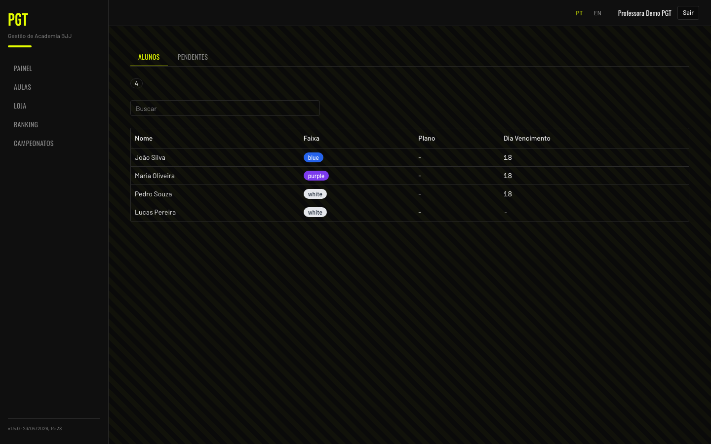

1. Abra a página de detalhes de um aluno
   <em>Open a student's detail page</em>
2. Clique em **"Atribuir Plano"**
   <em>Click "Atribuir Plano" (Assign Plan)</em>
3. Escolha um plano no menu suspenso, defina a data de início e o dia de vencimento (dia do mês)
   <em>Pick a plan from the dropdown, set start date and due day (day of month)</em>
4. Toque em **"Salvar"**
   <em>Tap "Salvar" (Save)</em>

Quando um plano já está atribuído, o botão **"Pagar Mês Atual"** aparece no cartão de plano — use-o para registrar rapidamente o pagamento do mês corrente sem sair da página.
<em>When a plan is already assigned, the "Pagar Mês Atual" (Pay Current Month) button appears on the plan card — use it to quickly record the current month's payment without leaving the page.</em>

## Painel da Academia
<em>Owner Dashboard</em>

O Painel da Academia é uma visão de alto nível da presença dos alunos e do engajamento nas aulas. É visível apenas para o **dono da academia** (papel `owner`) — o sistema diferencia o dono (quem opera a academia) dos instrutores (alunos promovidos que também dão aula). Se você criou a academia, você é o dono automaticamente.
<em>The Academy Dashboard is a high-level view of student attendance and class engagement. It's visible only to the academy **owner** (role `owner`) — the system distinguishes the owner (who runs the academy) from instructors (promoted students who also teach). If you created the academy, you're the owner automatically.</em>

> [!note] Dono vs. Instrutor
> Na prática, o dono costuma ser também instrutor. Mas um instrutor promovido (aluno que passou a dar aulas) **não** vê o Painel da Academia — só o dono vê.
> <em>In practice, the owner is usually also an instructor. But a promoted instructor (a student who teaches) does **not** see the Academy Dashboard — only the owner does.</em>

### Acessar o Painel
<em>Open the Dashboard</em>

1. No **Painel** inicial (`/dashboard`), procure o cartão **"Academy dashboard"** — ele aparece apenas para o dono
   <em>On the main Dashboard (`/dashboard`), look for the "Academy dashboard" card — it appears only for the owner</em>
2. Toque no cartão para abrir `/owner/dashboard`
   <em>Tap the card to open `/owner/dashboard`</em>
3. Alternativamente, acesse a URL `/owner/dashboard` diretamente. Alunos ou instrutores (não-donos) que tentarem essa URL verão a mensagem **"Forbidden (403)"**
   <em>Alternatively, visit the URL `/owner/dashboard` directly. Students or instructors (non-owners) who try this URL see a "Forbidden (403)" message</em>

### Filtrar por Período
<em>Period Filter</em>

No topo do painel há um alternador **Day / Week / Month**. O padrão é **Week** (semana ISO, de segunda a domingo, no fuso da academia). Trocar o período recarrega o gráfico e a lista de aulas com dados do intervalo selecionado. O período fica salvo na URL (`?period=week`), então você pode compartilhar um link com a visão que está vendo.
<em>At the top of the dashboard there's a **Day / Week / Month** toggle. Default is **Week** (ISO week, Monday through Sunday, in the academy timezone). Switching the period reloads the chart and classes list for the selected range. The period is saved in the URL (`?period=week`), so you can share a link to the view you're looking at.</em>

### Aderência por Aula
<em>Class Adherence Chart</em>

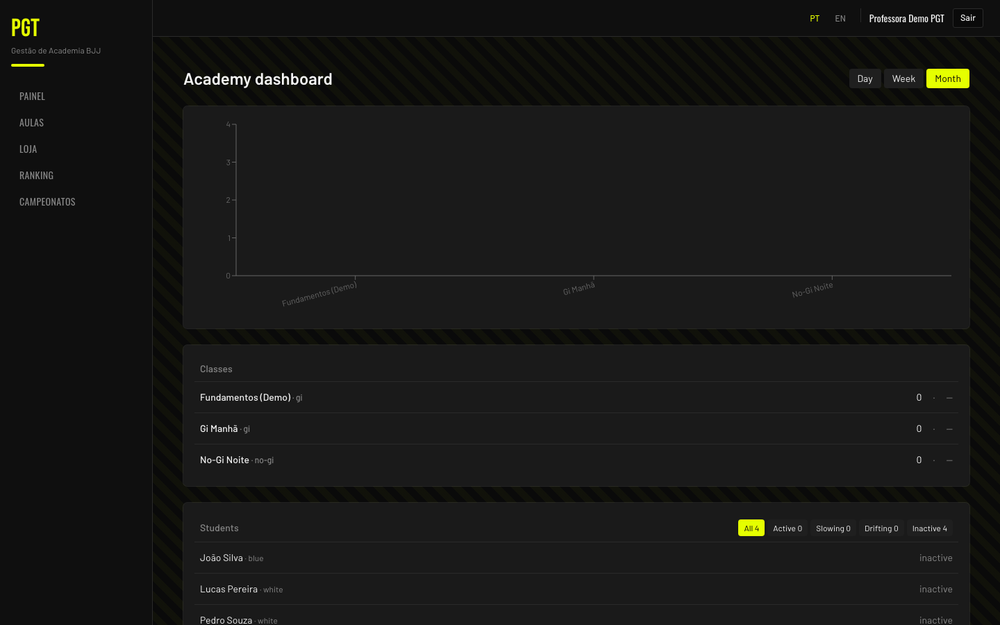

O gráfico de barras mostra o total de check-ins por aula no período selecionado. Cada barra corresponde a uma aula ativa, ordenadas do maior para o menor total. Passe o mouse (ou toque) sobre uma barra para ver:
<em>The bar chart shows total check-ins per class for the selected period. Each bar is one active class, sorted highest to lowest total. Hover (or tap) a bar to see:</em>

- **Total** — check-ins totais no período
  <em>Total — total check-ins in the period</em>
- **Unique students** — quantos alunos distintos apareceram
  <em>Unique students — how many distinct students showed up</em>
- **Avg/occurrence** — média de alunos por ocorrência (dia) da aula
  <em>Avg/occurrence — average students per class occurrence (day)</em>
- **Trend** — comparação com a média das últimas 4 ocorrências da mesma aula. Ex.: `120%` significa 20% acima da base; `80%` significa 20% abaixo
  <em>Trend — comparison against the rolling average of the last 4 occurrences. e.g., `120%` means 20% above baseline; `80%` means 20% below</em>

### Lista de Aulas com Tendência
<em>Classes List with Trend</em>

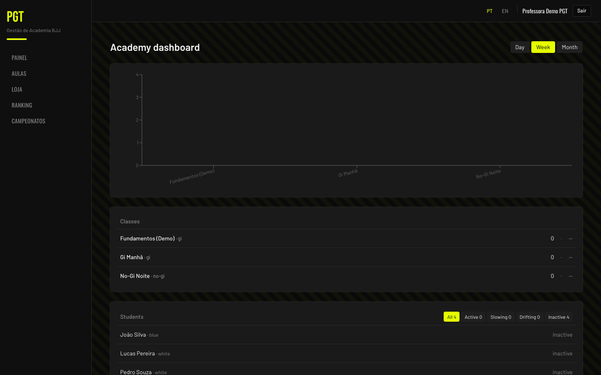

Abaixo do gráfico, cada aula aparece como uma linha com nome, tipo, total de check-ins e uma **seta de tendência**:
<em>Below the chart, each class appears as a row with name, type, total check-ins, and a **trend arrow**:</em>

- **↑ verde** — aderência acima da média das últimas 4 ocorrências (+10% ou mais)
  <em>↑ green — adherence above the last-4-occurrence baseline (+10% or more)</em>
- **→ cinza** — aderência dentro da faixa normal (entre -10% e +10%)
  <em>→ grey — adherence within normal range (between -10% and +10%)</em>
- **↓ vermelho** — aderência caindo (-10% ou mais abaixo)
  <em>↓ red — adherence falling (-10% or more below)</em>
- **—** — tendência indisponível (aula com menos de 3 ocorrências anteriores)
  <em>— — trend unavailable (class with fewer than 3 prior occurrences)</em>

Clique em qualquer linha para expandi-la:
<em>Click any row to expand it:</em>

1. Aparece um mini gráfico de linha com os check-ins por dia nas últimas ocorrências
   <em>A mini line chart shows check-ins per day across recent occurrences</em>
2. Abaixo, a **lista de presença** (roster) da ocorrência mais recente — nome e faixa de cada aluno que fez check-in
   <em>Below it, the **roster** for the most recent occurrence — name and belt of each student who checked in</em>
3. Apenas uma aula fica expandida por vez — clique em outra linha para trocar, ou na mesma para recolher
   <em>Only one class is expanded at a time — click another row to switch, or the same row to collapse</em>

### Lista de Alunos por Atividade
<em>Students List by Activity</em>

A seção de alunos mostra todos os alunos da academia agrupados pelo tempo desde o último check-in. No topo há chips de filtro com a contagem de cada bucket:
<em>The students section shows every student in the academy grouped by days since their last check-in. At the top, filter chips show the count in each bucket:</em>

| Chip | Dias desde o último check-in | Cor |
|------|------------------------------|-----|
| **Active** | 0 a 6 dias | Verde |
| **Slowing** | 7 a 13 dias | Âmbar |
| **Drifting** | 14 a 29 dias | Vermelho |
| **Inactive** | 30 dias ou mais, ou nunca treinou | Cinza |

<em>Active: 0–6 days since last check-in (green). Slowing: 7–13 days (amber). Drifting: 14–29 days (red). Inactive: 30+ days, or never trained (grey).</em>

Toque em **All** para ver todos, ou em qualquer outro chip para filtrar. Clique em uma linha de aluno para expandir:
<em>Tap **All** to see everyone, or any other chip to filter. Click a student row to expand:</em>

- **Total** — total de check-ins do aluno em todas as aulas
  <em>Total — student's total check-ins across all classes</em>
- **Classes** — número de aulas diferentes que o aluno já frequentou
  <em>Classes — number of distinct classes the student has attended</em>
- **Streak** — sequência atual de semanas consecutivas com ≥ 1 check-in
  <em>Streak — current run of consecutive weeks with ≥ 1 check-in</em>
- **Best** — maior sequência já alcançada
  <em>Best — longest streak ever achieved</em>
- Histórico dos últimos 30 dias (data + nome da aula)
  <em>Last 30 days of history (date + class name)</em>

> [!tip] Fluxo de retenção
> Use o chip **Drifting** como sinal de alerta — são alunos que vinham treinando e pararam há 2–4 semanas. Uma mensagem no WhatsApp nessa janela costuma trazê-los de volta antes de virarem **Inactive**.
> <em>Retention tip: use the **Drifting** chip as an early-warning list — these are students who were training and stopped 2–4 weeks ago. A WhatsApp message in that window often brings them back before they become **Inactive**.</em>

## Aulas
<em>Classes</em>

### Criar uma Aula
<em>Create a Class</em>

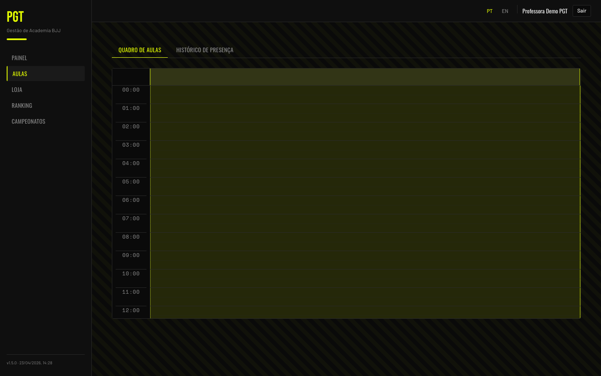

1. Menu lateral → **Aulas**
   <em>Sidebar → Aulas (Classes)</em>
2. Toque em **"Criar Aula"**
   <em>Tap "Criar Aula" (Create Class)</em>
3. Preencha: nome, tipo (Gi / No-Gi / Open Mat / Kids), dias da semana (seleção múltipla), horário de início e término
   <em>Fill in: name, type (Gi / No-Gi / Open Mat / Kids), days of week (multi-select), start and end time</em>
4. Uma aula separada é criada para cada dia selecionado
   <em>A separate class is created for each day you select</em>

### Editar ou Excluir uma Aula
<em>Edit or Delete a Class</em>

- Em qualquer cartão de aula, toque no **ícone de lápis** para editar
  <em>On any class card, tap the pencil icon to edit</em>
- Toque no **ícone de lixeira** para excluir (exclusão suave — os check-ins históricos são preservados)
  <em>Tap the trash icon to delete (soft delete — historical check-ins are preserved)</em>

### Ver Histórico de Check-ins
<em>View Check-in History</em>

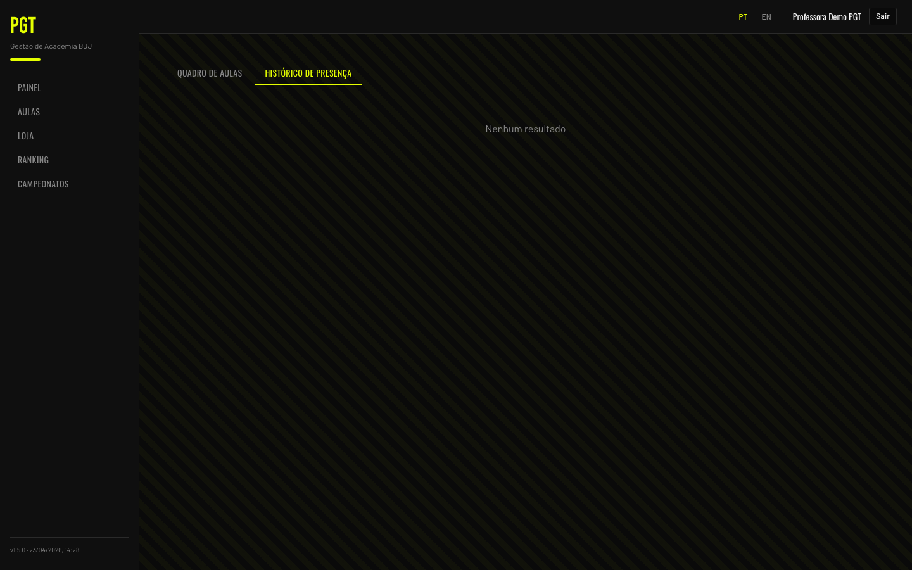

1. Menu lateral → **Aulas** → aba **Histórico de Presença**
   <em>Sidebar → Aulas (Classes) → Histórico de Presença tab</em>
2. Veja todos os check-ins dos alunos com data, nome da aula e tipo
   <em>See all student check-ins with date, class name, and type</em>

## Sistema de Check-in
<em>Check-in System</em>

Os alunos podem fazer check-in nas aulas de duas formas:
<em>Students can check in to classes two ways:</em>

### Método 1: Botão de Proximidade
<em>Method 1: Proximity Button</em>

Os alunos tocam em um botão no celular. O sistema verifica se eles estão a menos de 250 metros da academia (usando GPS) e se a aula está ativa no momento (15 min antes até 1 hora após o horário programado).
<em>Students tap a button on their phone. The system verifies they're within 250 meters of your gym (using GPS) and that the class is currently active (15 min before to 1 hour after the scheduled time).</em>

### Método 2: Totem com QR Code
<em>Method 2: QR Code Totem</em>

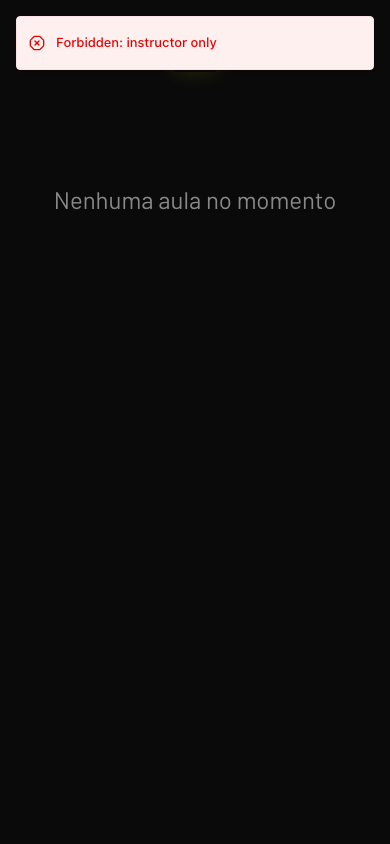

O totem de QR Code transforma qualquer tablet em uma estação de check-in.
<em>The QR code totem turns any tablet into a check-in station.</em>

1. Abra `/totem` em um tablet na entrada da academia
   <em>Open `/totem` on a tablet at your gym entrance</em>
2. A página mostra automaticamente os QR Codes de todas as aulas ativas no momento
   <em>The page automatically shows QR codes for all currently active classes</em>
3. Os códigos são atualizados a cada **4 minutos**
   <em>Codes refresh every 4 minutes</em>
4. Os alunos escaneiam com a câmera do celular → o check-in é concluído automaticamente
   <em>Students scan with their phone camera → check-in completes automatically</em>

> [!tip]
> Deixe a página do totem aberta o dia todo. Ela detecta automaticamente quais aulas estão ativas com base no horário.
> <em>Leave the totem page open all day. It auto-detects which classes are active based on the schedule.</em>

## Financeiro
<em>Billing</em>

### Criar Planos de Matrícula
<em>Create Membership Plans</em>

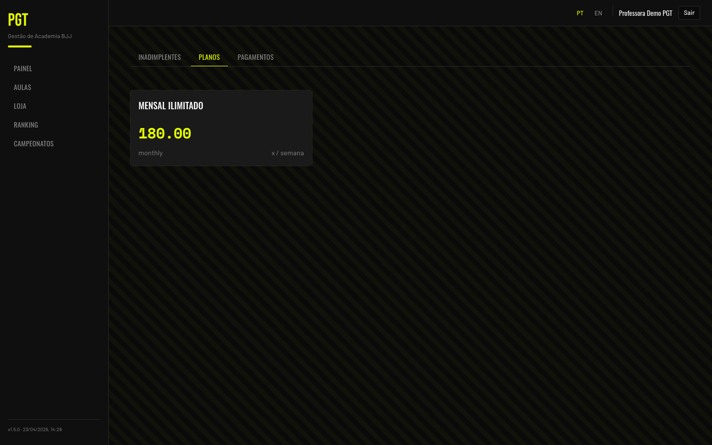

1. Menu lateral → **Financeiro** → aba **Planos**
   <em>Sidebar → Financeiro (Billing) → Planos tab</em>
2. Toque em **"Criar Plano"**
   <em>Tap "Criar Plano" (Create Plan)</em>
3. Preencha: nome do plano, preço, frequência (Mensal / Trimestral / Anual) e aulas por semana
   <em>Fill in: plan name, price, frequency (Mensal / Trimestral / Anual), and classes per week</em>
4. Toque em **"Criar"** para salvar
   <em>Tap "Criar" (Create) to save</em>

### Editar Planos
<em>Edit Plans</em>

Clique no botão **"Editar"** em qualquer cartão de plano para atualizar o valor ou os detalhes. O diálogo de edição é exibido com os mesmos campos e um botão **"Salvar"** para confirmar.
<em>Click the "Editar" (Edit) button on any plan card to update price or details. The edit dialog shows the same fields and a "Salvar" (Save) button to confirm.</em>

### Registrar um Pagamento
<em>Record a Payment</em>

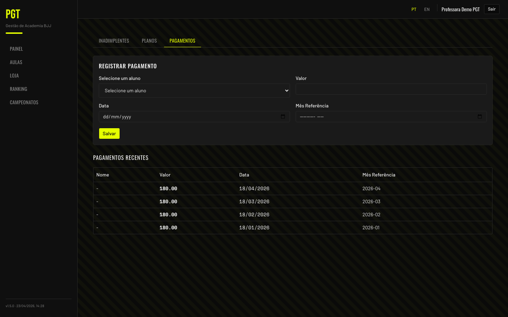

1. Menu lateral → **Financeiro** → aba **Pagamentos**
   <em>Sidebar → Financeiro (Billing) → Pagamentos tab</em>
2. O formulário **"Registrar Pagamento"** já aparece visível no topo da página — não é necessário clicar em nenhum botão para abri-lo
   <em>The "Registrar Pagamento" (Record Payment) form is already visible at the top of the page — no button press needed to open it</em>
3. Selecione o aluno, preencha o valor, a data do pagamento e o mês de referência (qual mês o pagamento cobre)
   <em>Select the student, fill in the amount, payment date, and reference month (which month the payment covers)</em>
4. Toque em **"Salvar"**
   <em>Tap "Salvar" (Save)</em>
5. Os pagamentos registrados aparecem na seção **"Pagamentos Recentes"** abaixo do formulário
   <em>Recorded payments appear in the "Pagamentos Recentes" (Recent Payments) section below the form</em>

### Acompanhar Alunos em Atraso
<em>Track Overdue Students</em>

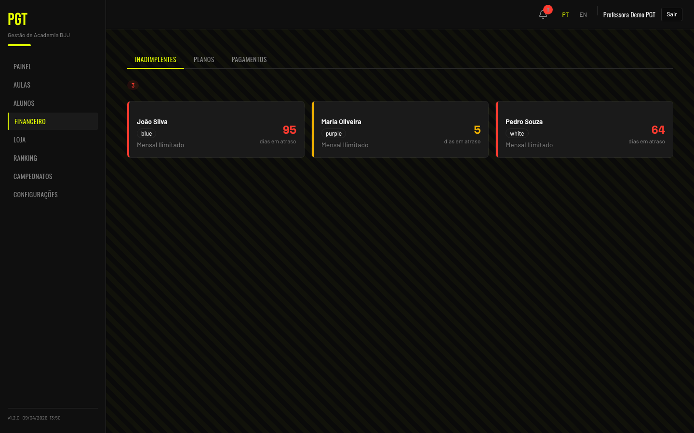

1. Menu lateral → **Financeiro** → aba **Inadimplentes**
   <em>Sidebar → Financeiro (Billing) → Inadimplentes tab</em>
2. Alunos com mensalidades não pagas após o dia de vencimento aparecem aqui
   <em>Students with unpaid memberships past their due day appear here</em>
3. Os cartões são coloridos: amarelo (menos de 8 dias de atraso) ou vermelho (8 ou mais dias de atraso)
   <em>Cards are color-coded: yellow (less than 8 days late) or red (8 or more days late)</em>

## Notificações
<em>Notifications</em>

### Sino de Notificações
<em>Notification Bell</em>

O ícone de sino no cabeçalho superior direito exibe um badge vermelho com o número de alunos em atraso **não silenciados**. O sino aparece em todas as páginas autenticadas.
<em>The bell icon in the top-right header shows a red badge with the count of unmuted overdue students. The bell appears on every authenticated page.</em>

Clique no sino para ver o menu suspenso com cada aluno em atraso. Para cada um, você pode:
<em>Click the bell to see the dropdown with each overdue student. For each one you can:</em>

- **Enviar lembrete** — abre o WhatsApp com uma mensagem de cobrança pré-preenchida (disponível apenas se o aluno tiver um número de telefone cadastrado)
  <em>Enviar lembrete (Send Reminder) — opens WhatsApp with a pre-filled payment reminder message (only shown when the student has a phone number on file)</em>
- **Enviar email** — envia um e-mail de cobrança; o botão muda para **"Email enviado"** e fica desativado após o envio
  <em>Enviar email (Send Email) — sends a payment reminder email; button changes to "Email enviado" and disables after sending</em>
- **Silenciar** (ícone BellOff, sem rótulo de texto) — oculta o aluno da lista de notificações
  <em>Mute (BellOff icon, no text label) — hides the student from the notification list</em>

### Silenciar um Aluno
<em>Mute a Student</em>

Se um aluno tiver um acordo especial (ex.: ajuda a limpar a academia em troca de desconto), toque no ícone **BellOff** (sino riscado, sem texto) no menu do sino de notificações para parar de vê-lo na lista de inadimplentes. O aluno é removido do badge e do painel de notificações imediatamente.
<em>If a student has a special arrangement (e.g., helping clean the gym in exchange for a discount), tap the BellOff icon (no text label) in the notification bell dropdown to stop seeing them in your overdue list. The student is removed from the badge count and the dropdown immediately.</em>

## Loja
<em>Marketplace</em>

### Adicionar Produtos
<em>Add Products</em>

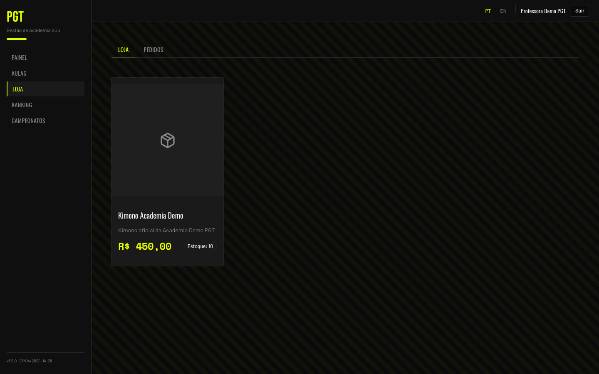

1. Menu lateral → **Loja** (a aba **LOJA** já estará ativa — não há uma aba separada chamada "Produtos")
   <em>Sidebar → Loja (Marketplace) — the LOJA tab is already active; there is no separate "Produtos" sub-tab</em>
2. Toque em **"Adicionar Produto"**
   <em>Tap "Adicionar Produto" (Add Product)</em>
3. Preencha nome, descrição, preço, estoque
   <em>Fill in name, description, price, stock</em>
4. Toque em **"Salvar"**
   <em>Tap "Salvar" (Save)</em>

### Gerenciar Pedidos
<em>Manage Orders</em>

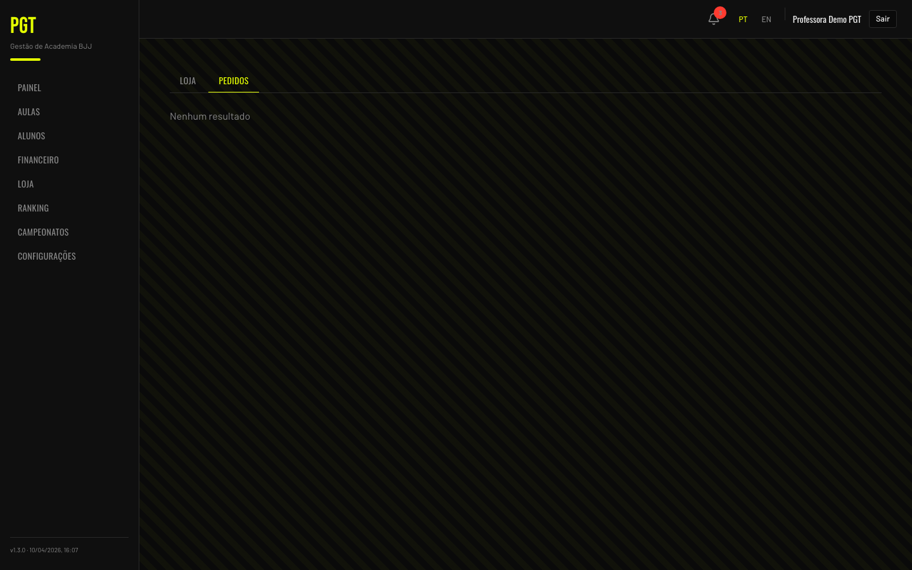

1. Menu lateral → **Loja** → aba **PEDIDOS**
   <em>Sidebar → Loja (Marketplace) → PEDIDOS tab</em>
2. Veja todos os pedidos dos alunos com status: **Pendente**, **Confirmado**, **Entregue** ou **Cancelado**
   <em>See all student orders with status: Pendente (Pending), Confirmado (Confirmed), Entregue (Delivered), or Cancelado (Cancelled)</em>
3. Para pedidos **Pendentes**: toque em **"Confirmar"** para aceitar ou **"Cancelar"** para recusar
   <em>For Pendente orders: tap "Confirmar" (Confirm) to accept or "Cancelar" (Cancel) to decline</em>
4. Para pedidos **Confirmados**: toque em **"Entregar"** para marcar como entregue
   <em>For Confirmado orders: tap "Entregar" (Deliver) to mark as delivered</em>

## Gamificação
<em>Gamification</em>

### Criar uma Temporada
<em>Create a Season</em>

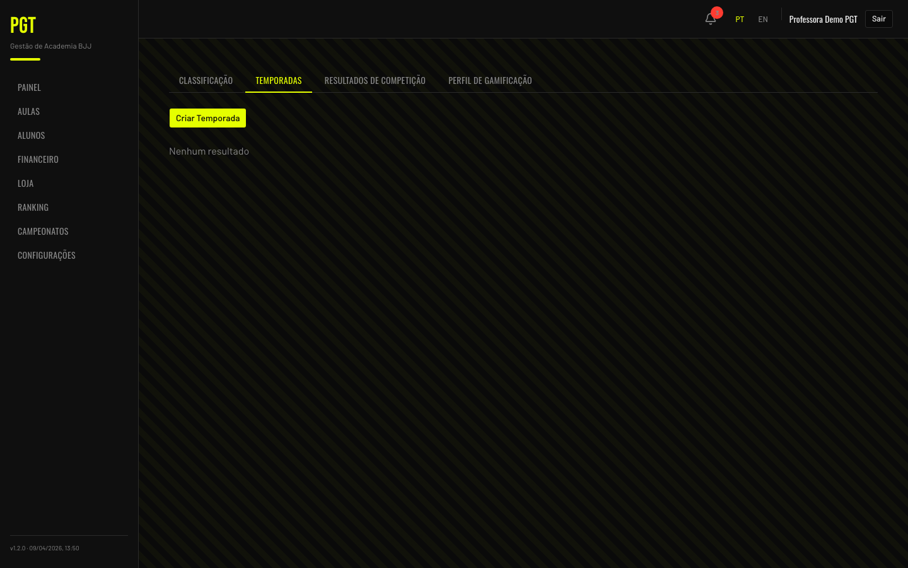

1. Menu lateral → **Ranking** → aba **Temporadas**
   <em>Sidebar → Ranking → Temporadas tab</em>
2. Toque em **"Criar Temporada"**
   <em>Tap "Criar Temporada" (Create Season)</em>
3. Defina: nome da temporada, data de início, data de término, **premiação** (opcional) e pontos concedidos para 1º/2º/3º lugar
   <em>Set: season name, start date, end date, premiação (prize, optional), and points awarded for 1st/2nd/3rd place</em>
4. Toque em **"Criar"** para salvar
   <em>Tap "Criar" (Create) to save</em>

### Aprovar Resultados de Competição
<em>Approve Competition Results</em>

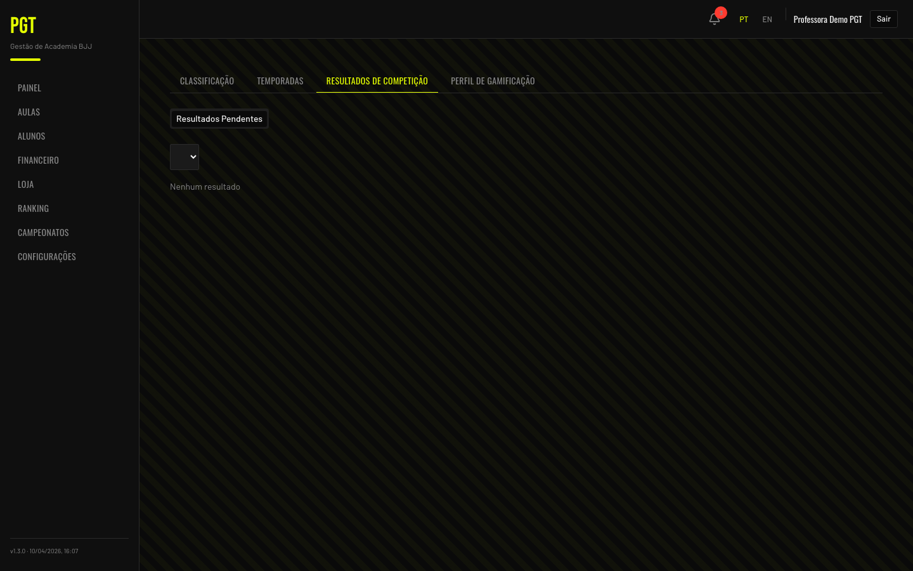

Quando os alunos enviam resultados, você os analisa.
<em>When students submit results, you review them.</em>

1. Menu lateral → **Ranking** → aba **Resultados de Competição**
   <em>Sidebar → Ranking → Resultados de Competição tab</em>
2. Selecione a temporada no seletor acima da lista (se houver mais de uma)
   <em>Select the season in the dropdown above the list (if there is more than one)</em>
3. Resultados pendentes são exibidos com nome do aluno, competição, data e badge de colocação
   <em>Pending results are shown with student name, competition, date, and placement badge</em>
4. Toque em **Aprovar** para conceder pontos ou **Rejeitar** para recusar
   <em>Tap Aprovar (Approve) to award points or Rejeitar (Reject) to decline</em>

### Ver o Ranking
<em>View Leaderboard</em>

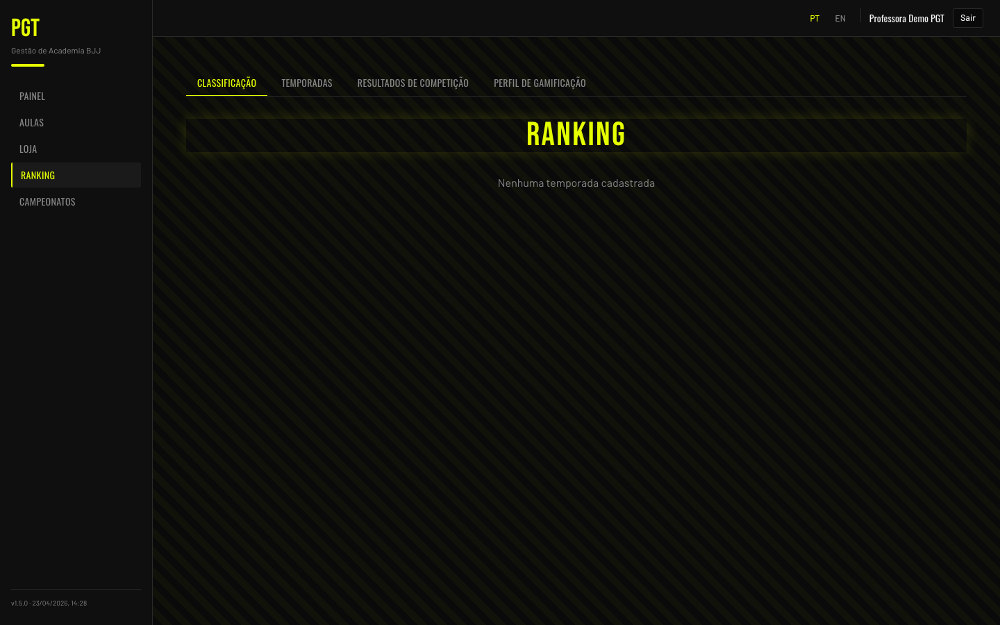

Menu lateral → **Ranking** → aba **Classificação**. Use os filtros de categoria (**Adultos** / **Kids**) e de faixa (**Todas as faixas** / white / blue / purple / brown / black) para segmentar a lista.
<em>Sidebar → Ranking → Classificação tab. Use category filters (Adultos / Kids) and belt filters (Todas as faixas / white / blue / purple / brown / black) to segment the list.</em>

## Campeonatos
<em>Tournaments</em>

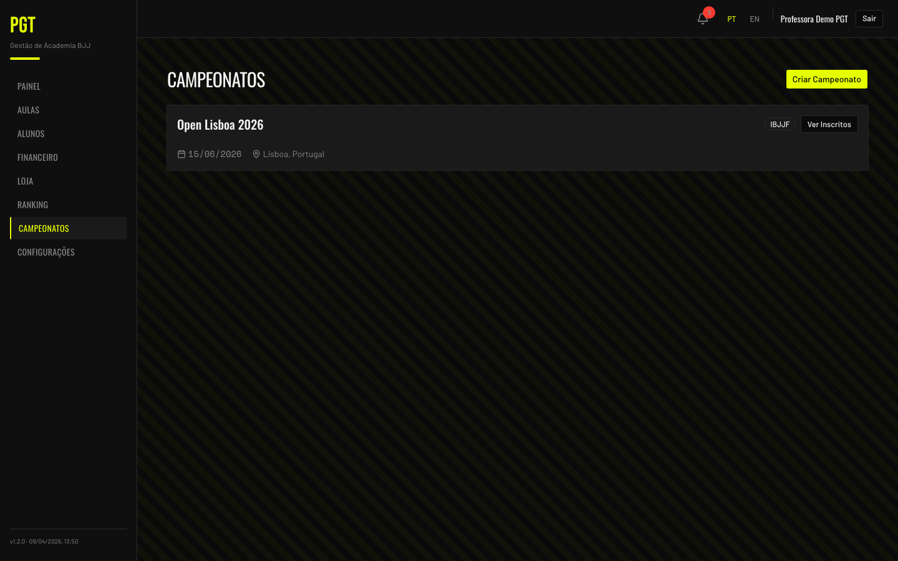

1. Menu lateral → **Campeonatos**
   <em>Sidebar → Campeonatos (Tournaments)</em>
2. Toque em **"Criar Campeonato"** para adicionar eventos futuros
   <em>Tap "Criar Campeonato" (Create Tournament) to add upcoming events</em>
3. Para ver os inscritos, toque em **"Ver Inscritos"** em qualquer cartão de campeonato — a lista expande abaixo com nome, faixa e categoria de peso
   <em>To see registered participants, tap "Ver Inscritos" on any tournament card — the roster expands below showing name, belt, and weight category</em>
4. Os alunos se inscrevem por conta própria escolhendo sua categoria de peso
   <em>Students sign up themselves by choosing their weight class</em>

## Dicas
<em>Tips</em>

- **Defina a localização da academia primeiro** — os check-ins por proximidade não funcionam sem ela
  <em>Set the gym location first — proximity check-ins won't work without it</em>
- **Deixe o totem aberto em um tablet** — é o método de check-in mais fácil para os alunos
  <em>Leave the totem open on a tablet — it's the easiest check-in method for students</em>
- **Use lembretes pelo WhatsApp** — os alunos respondem muito mais rápido do que por e-mail
  <em>Use WhatsApp reminders — students respond much faster than to email</em>
- **Verifique o painel diariamente** — visão geral rápida das estatísticas
  <em>Check the dashboard daily — quick stats overview</em>
- **O sino de notificações** — seu fluxo diário de gestão de pagamentos fica aqui
  <em>The notification bell — your daily payment-management workflow lives here</em>
