# Guia do Dono da Academia
<em>Owner Guide</em>

Guia completo para gerenciar sua academia de BJJ com o PGT. O **Dono** é o único papel de equipe no app: é quem opera a academia — alunos, aulas, mensalidades, famílias e loja.
<em>Complete guide to managing your BJJ academy with PGT. The **Owner** is the only staff role in the app: the person who runs the academy — students, classes, monthly fees, families, and the shop.</em>

> [!info] Guias relacionados
> - [Guia do Aluno](./User%20Guide%20-%20Student.md)
> - [Glossário](./CONTEXT.md)

## Primeiros Passos
<em>Getting Started</em>

### Entrar na Conta
<em>Sign In</em>

Acesse o PGT pelo navegador. A tela de login pede e-mail e senha.
<em>Open PGT in your browser. The login screen asks for email and password.</em>

1. Preencha **E-mail** e **Senha**
   <em>Fill in Email and Password</em>
2. Toque em **"Entrar"**
   <em>Tap "Entrar" (Log In)</em>
3. Você é levado ao **Painel da Academia**
   <em>You land on the Academy Dashboard</em>

Esqueceu a senha? Toque em **"Esqueceu a senha?"** na tela de login para receber um link de recuperação no seu e-mail.
<em>Forgot your password? Tap "Esqueceu a senha?" on the login screen to receive a recovery link by email.</em>

### Recuperar Senha
<em>Recover Password</em>

1. Na tela de login, toque em **"Esqueceu a senha?"**
   <em>On the login screen, tap "Esqueceu a senha?" (Forgot your password?)</em>
2. Digite seu e-mail e toque em **"Enviar Link"**
   <em>Enter your email and tap "Enviar Link" (Send Link)</em>
3. Se o e-mail existir no sistema, você receberá um link de recuperação (mensagem: "Se o email existir em nossa base, enviaremos um link de recuperação.")
   <em>If the email exists in the system, you will receive a recovery link (message: "If the email exists in our system, we'll send a recovery link.")</em>
4. Clique no link recebido por e-mail para abrir a página **"Redefinir Senha"**
   <em>Click the link in your email to open the "Redefinir Senha" (Reset Password) page</em>
5. Preencha **"Nova Senha"** e **"Confirmar Senha"**, depois toque em **"Redefinir"**
   <em>Fill in "Nova Senha" (New Password) and "Confirmar Senha" (Confirm Password), then tap "Redefinir" (Reset)</em>
6. Após o sucesso, toque em **"Voltar ao Login"**
   <em>After success, tap "Voltar ao Login" (Back to Login)</em>

### Criar Sua Academia
<em>Create Your Academy</em>

1. Na tela de login, toque em **"Criar Conta"**
   <em>On the login screen, tap "Criar Conta" (Sign Up)</em>
2. Na tela seguinte, escolha **"Criar Academia"**
   <em>On the next screen, choose "Criar Academia" (Create Academy)</em>
3. Em **Seus Dados**, preencha nome, e-mail e senha; em **Sua Academia**, preencha o nome da academia e a cidade
   <em>Under Seus Dados (Your Details), fill in name, email and password; under Sua Academia (Your Academy), fill in the academy name and city</em>
4. Toque em **"Criar Academia"** — você se torna o dono da nova academia
   <em>Tap "Criar Academia" — you become the owner of the new academy</em>

### Navegar no App
<em>Navigating the App</em>

O menu tem: **Painel**, **Aulas**, **Alunos**, **Financeiro**, **Loja**, **Ranking**, **Campeonatos**, **Configurações** e **Totem**.
<em>The menu has: Painel (Dashboard), Aulas (Classes), Alunos (Students), Financeiro (Billing), Loja (Marketplace), Ranking, Campeonatos (Tournaments), Configurações (Settings), and Totem (Kiosk).</em>

- **No computador**: o menu fica fixo na lateral esquerda
  <em>On a computer: the menu is fixed on the left side</em>
- **No celular**: toque no botão **Menu** (☰) no canto superior esquerdo para abrir o menu; ao escolher uma página ele fecha sozinho
  <em>On a phone: tap the Menu button (☰) in the top-left corner to open the menu; it closes by itself when you pick a page</em>
- No cabeçalho ficam o **sino de notificações**, a troca de idioma **PT / EN** (a escolha fica salva no dispositivo) e o botão **"Sair"**
  <em>The header holds the notification bell, the PT / EN language switch (the choice is saved on the device), and the "Sair" (Log Out) button</em>

Neste guia, "Menu → X" significa abrir o item X pelo menu (lateral ou ☰).
<em>In this guide, "Menu → X" means opening item X from the menu (sidebar or ☰).</em>

Valores em euro aparecem no formato de Portugal, por exemplo **45,00 €**.
<em>Euro amounts are shown Portugal-style in Portuguese, e.g. 45,00 € (€45.00 in English).</em>

### Definir a Localização da Academia
<em>Set Your Gym Location</em>

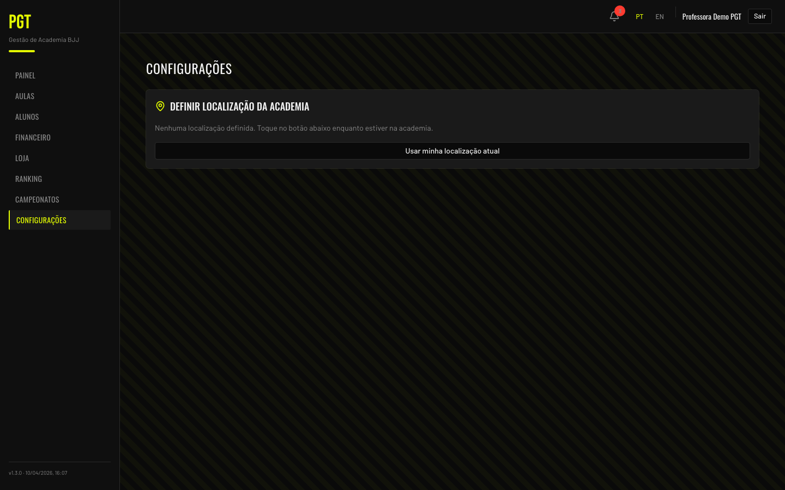

Isso é necessário para que os check-ins por proximidade funcionem.
<em>This is required for proximity-based check-ins to work.</em>

1. Menu → **Configurações**
   <em>Menu → Configurações (Settings)</em>
2. O cartão **"Definir localização da academia"** aparece com o ícone de mapa
   <em>The "Definir localização da academia" (Set academy location) card appears with a map pin icon</em>
3. Estando na academia, toque em **"Usar minha localização atual"**
   <em>While at the gym, tap "Usar minha localização atual" (Use my current location)</em>
4. Seu navegador solicitará permissão de localização — aprove
   <em>Your browser will ask for location permission — approve it</em>
5. As coordenadas são salvas e exibidas na tela ("Localização salva")
   <em>Coordinates are saved and displayed on screen ("Localização salva" — Location saved)</em>

> [!tip]
> Se aparecer a mensagem "Geolocalização indisponível", o navegador bloqueou o acesso ao GPS. Verifique as permissões do site.
> <em>If you see "Geolocalização indisponível" (Geolocation unavailable), the browser blocked GPS access. Check your site permissions.</em>

### Compartilhar Seu Código de Acesso
<em>Share Your Join Code</em>

Os alunos precisam de um código de acesso para se cadastrar na sua academia.
<em>Students need a join code to register at your academy.</em>

1. Menu → **Configurações**
   <em>Menu → Configurações (Settings)</em>
2. O código aparece no cartão com o nome da sua academia (ex.: `PGT-PONTINHA-CM7`), abaixo do rótulo **"Código de Acesso"**
   <em>The code appears in the card with your academy name (e.g., `PGT-PONTINHA-CM7`), below the "Código de Acesso" (Access Code) label</em>
3. Toque em **"Copiar"** (muda para **"Copiado!"**) ou em **"Compartilhar no WhatsApp"** — a mensagem leva um link que já abre o cadastro com o código preenchido
   <em>Tap "Copiar" (Copy — changes to "Copiado!") or "Compartilhar no WhatsApp" (Share on WhatsApp) — the message carries a link that opens sign-up with the code already filled in</em>

## Gerenciando Alunos
<em>Managing Students</em>

A página **Alunos** tem três abas: **Alunos**, **Pendentes** e **Famílias**.
<em>The Alunos (Students) page has three tabs: Alunos (Students), Pendentes (Pending), and Famílias (Families).</em>

### Aprovar Novos Alunos
<em>Approve New Students</em>

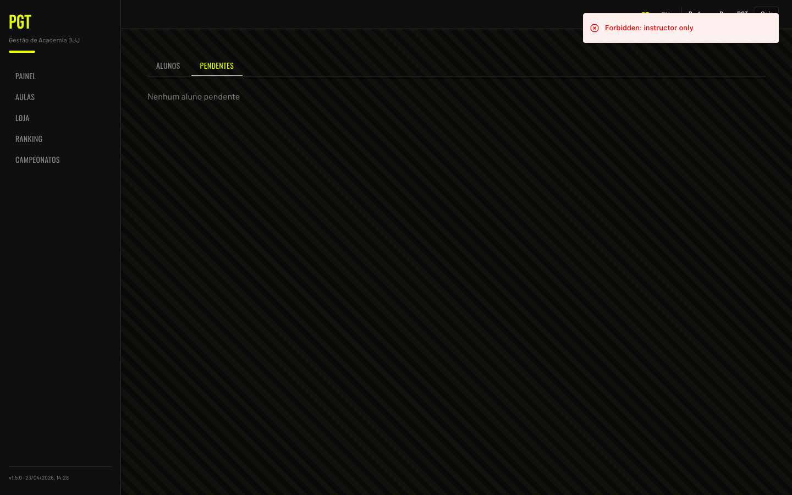

Quando um aluno entra com seu código, ele aparece como **Pendente**.
<em>When a student joins with your code, they appear as Pending.</em>

1. Menu → **Alunos** → aba **Pendentes**
   <em>Menu → Alunos → Pendentes tab</em>
2. Toque em **"Aprovar"** para liberar o acesso
   <em>Tap "Aprovar" (Approve) to grant access</em>
3. Para recusar, toque em **"Rejeitar"** e confirme em **"Confirmar"** ("Rejeitar o cadastro de …?")
   <em>To decline, tap "Rejeitar" (Reject) and confirm with "Confirmar" ("Reject …'s sign-up?")</em>

### Lista de Alunos
<em>Students List</em>

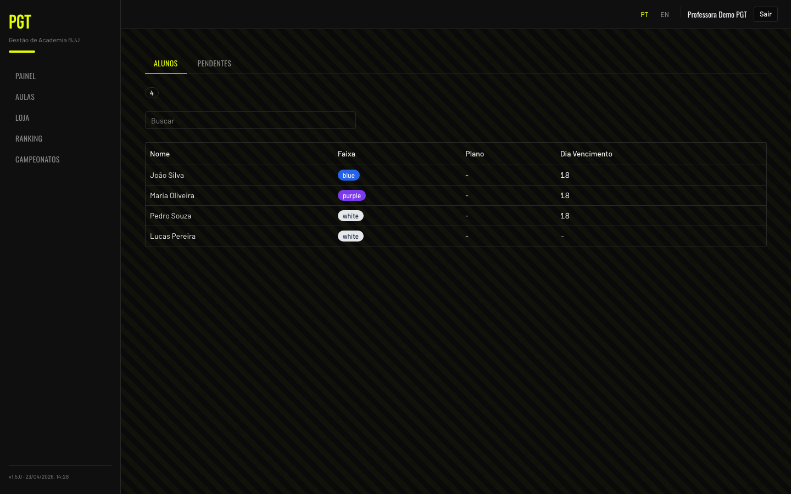

1. Menu → **Alunos** (a aba **Alunos** estará ativa)
   <em>Menu → Alunos (the Alunos tab will be active)</em>
2. Cada aluno mostra nome (e o nome da família, se tiver), faixa, **Modalidades**, **Mensalidade** e **Dia Vencimento**
   <em>Each student shows name (and family name, if any), belt, Modalities, Monthly Fee, and Due Day</em>
3. Use **Buscar** para filtrar por nome
   <em>Use Buscar (Search) to filter by name</em>
4. Use os botões de modalidade (**Todas**, **Jiu-Jitsu**, **MMA**, …) para ver só quem treina aquela modalidade — só aparecem modalidades que algum aluno treina
   <em>Use the modality buttons (Todas / All, Jiu-Jitsu, MMA, …) to see only who trains that modality — only modalities some student trains are listed</em>
5. A lista mostra 50 alunos por vez; toque em **"Mostrar mais"** para carregar mais. Toque em qualquer aluno para abrir a página dele
   <em>The list shows 50 students at a time; tap "Mostrar mais" (Show more) to load more. Tap any student to open their page</em>

### Página do Aluno
<em>Student Page</em>

A página do aluno mostra e-mail, telefone, a linha **Família**, total de aulas, sequência atual, XP e os cartões **Mensalidade**, **Treino**, **Meses isentos** e **Histórico de Pagamentos**.
<em>The student page shows email, phone, the Família (Family) line, total classes, current streak, XP, and the Mensalidade (Monthly Fee), Treino (Training), Meses isentos (Waived Months), and Histórico de Pagamentos (Payment History) cards.</em>

### Definir a Mensalidade
<em>Set the Monthly Fee</em>

Não existem planos: cada aluno tem a sua própria **Mensalidade**, digitada por você. Aluno sem mensalidade não é cobrado ("Sem mensalidade — não é cobrado").
<em>There are no plans: each student has their own Monthly Fee, typed in by you. A student without a Monthly Fee is not billed ("Sem mensalidade — não é cobrado").</em>

1. Abra a página do aluno → cartão **Mensalidade**
   <em>Open the student page → Mensalidade card</em>
2. Digite o valor em **"Mensalidade (€)"** ou toque em um dos **valores sugeridos**: **45,00 €**, **65,00 €**, **60,00 €** ou **35,00 €**
   <em>Type the amount in "Mensalidade (€)" (Monthly fee) or tap one of the suggested amounts: €45.00, €65.00, €60.00, or €35.00</em>
3. Ajuste o **Dia Vencimento** (1 a 28; padrão 8)
   <em>Adjust the Dia Vencimento (Due Day) (1 to 28; default 8)</em>
4. Toque em **"Salvar mensalidade"**
   <em>Tap "Salvar mensalidade" (Save monthly fee)</em>

> [!note] Valores sugeridos
> Os valores sugeridos são só atalhos (1 modalidade 45 €, 2 modalidades 65 €, trânsito livre 60 €, kids 35 €). Descontos são simplesmente uma mensalidade menor. Quando um aluno recebe mensalidade pela primeira vez, a cobrança começa no mês seguinte.
> <em>Suggested amounts are only shortcuts (1 modality €45, 2 modalities €65, open access €60, kids €35). Discounts are simply a lower Monthly Fee. When a student gets a Monthly Fee for the first time, billing starts the following month.</em>

### Pagar o Mês Atual
<em>Pay the Current Month</em>

Quando o aluno tem mensalidade, o botão **"Pagar Mês Atual"** aparece no cartão **Mensalidade**. Toque nele e confirme em **"Confirmar"** ("Registrar o pagamento do mês atual de …?") para registrar o mês corrente com o valor da mensalidade, sem sair da página.
<em>When the student has a Monthly Fee, the "Pagar Mês Atual" (Pay Current Month) button appears on the Mensalidade card. Tap it and confirm with "Confirmar" ("Record this month's payment for …?") to record the current month at the Monthly Fee, without leaving the page.</em>

### Treino: Modalidades e Observação
<em>Training: Modalities and Note</em>

O cartão **Treino** registra o que o aluno treina. É apenas informativo: não muda o preço nem restringe o check-in.
<em>The Treino (Training) card records what the student trains. It is informational only: it doesn't change the price or restrict check-in.</em>

1. Na página do aluno, marque as **Modalidades** que ele treina
   <em>On the student page, tick the Modalidades (Modalities) they train</em>
2. Use **"Observação de treino"** para o que as modalidades não dizem (ex.: "trânsito livre", "turma das 7h")
   <em>Use "Observação de treino" (Training note) for what modalities don't capture (e.g., "trânsito livre", "turma das 7h")</em>
3. Toque em **"Salvar treino"**
   <em>Tap "Salvar treino" (Save training)</em>

### Gerenciar Modalidades
<em>Manage Modalities</em>

A lista de modalidades (ex.: Jiu-Jitsu, MMA, Kids, Funcional, Feminino) é mantida por você.
<em>The modality list (e.g., Jiu-Jitsu, MMA, Kids, Funcional, Feminino) is maintained by you.</em>

1. Menu → **Configurações** → cartão **Modalidades**
   <em>Menu → Configurações (Settings) → Modalidades (Modalities) card</em>
2. Cada modalidade mostra quantos alunos a treinam
   <em>Each modality shows how many students train it</em>
3. Para adicionar: digite em **"Nova modalidade"** e toque em **"Adicionar"**
   <em>To add: type in "Nova modalidade" (New modality) and tap "Adicionar" (Add)</em>
4. Para renomear: toque em **"Renomear"**, edite o nome e toque em **"Salvar"**
   <em>To rename: tap "Renomear" (Rename), edit the name, and tap "Salvar" (Save)</em>
5. Para excluir: toque em **"Excluir modalidade"** e confirme em **"Excluir"**. O botão fica desativado enquanto algum aluno tiver a modalidade — remova-a dos alunos antes
   <em>To delete: tap "Excluir modalidade" (Delete modality) and confirm with "Excluir" (Delete). The button is disabled while any student has the modality — remove it from those students first</em>

> [!tip]
> Nomes repetidos são recusados ("Já existe uma modalidade com esse nome").
> <em>Duplicate names are refused ("Já existe uma modalidade com esse nome" — A modality with this name already exists).</em>

### Meses Isentos
<em>Waived Months</em>

Um **Mês isento** é um mês que o aluno não deve (não treinou, lesão, férias). Vale para qualquer aluno, com ou sem família. Por padrão, todos devem todos os meses.
<em>A Waived Month is a month the student doesn't owe (didn't train, injury, holidays). It applies to any student, in a family or not. By default, everyone owes every month.</em>

1. Na página do aluno → cartão **Meses isentos**
   <em>On the student page → Meses isentos (Waived Months) card</em>
2. Escolha o **Mês**, preencha o **Motivo (opcional)** e toque em **"Isentar mês"**
   <em>Pick the Mês (Month), fill in Motivo (opcional) (Reason, optional), and tap "Isentar mês" (Waive month)</em>
3. Para desfazer, toque em **"Remover"** ao lado do mês
   <em>To undo, tap "Remover" (Remove) next to the month</em>

Um mês isento não aparece como atraso, nem para você nem no aviso do aluno. Numa família, o membro isento sai da soma daquele mês (um preço acordado da família não é recalculado — ajuste o valor na hora do pagamento, se quiser).
<em>A waived month doesn't show as overdue, neither for you nor in the student's banner. In a family, the waived member drops out of that month's sum (a family agreed price is not recalculated — adjust the amount at payment time if you want).</em>

### Família do Aluno
<em>The Student's Family</em>

Na página do aluno, abaixo do telefone:
<em>On the student page, below the phone number:</em>

- Se o aluno tem família, aparece **"Família: <nome>"** — toque no nome para abrir a aba **Famílias**
  <em>If the student has a family, "Família: <name>" appears — tap the name to open the Famílias (Families) tab</em>
- Se não tem, toque em **"Adicionar a uma família"**: escolha uma **Família existente** e toque em **"Adicionar"**, ou digite o **Nome da família** e toque em **"Criar"** para criar uma nova só com ele
  <em>If not, tap "Adicionar a uma família" (Add to a family): pick an Família existente (Existing family) and tap "Adicionar" (Add), or type a Nome da família (Family name) and tap "Criar" (Create) to create a new one with just this student</em>

## Famílias
<em>Families</em>

Uma **Família** reúne alunos da mesma casa cujas mensalidades são pagas juntas (ex.: pais e filhos). Cada aluno pertence a **no máximo uma** família. O preço continua sendo por aluno; a família só junta a cobrança.
<em>A Family groups students of the same household whose monthly fees are paid together (e.g., parents and kids). Each student belongs to at most one family. Pricing stays per student; the family only groups the billing.</em>

Os alunos não veem nada sobre famílias no app deles.
<em>Students see nothing about families in their app.</em>

### Criar uma Família
<em>Create a Family</em>

1. Menu → **Alunos** → aba **Famílias**
   <em>Menu → Alunos → Famílias (Families) tab</em>
2. Toque em **"Nova família"**
   <em>Tap "Nova família" (New family)</em>
3. Preencha **"Nome da família"** (você escolhe o nome — sobrenomes podem ser diferentes)
   <em>Fill in "Nome da família" (Family name) — you choose the name; surnames may differ</em>
4. Em **"Buscar alunos sem família"**, digite um nome e toque no aluno (**+ Nome**) para adicioná-lo aos **Membros**. Só aparecem alunos que ainda não têm família
   <em>In "Buscar alunos sem família" (Search students without a family), type a name and tap the student (+ Name) to add them to Membros (Members). Only students without a family are listed</em>
5. Opcional: escolha o **Contato da família** e o **Preço acordado da família** (veja abaixo)
   <em>Optional: choose the Contato da família (Family contact) and the Preço acordado da família (Family agreed price) (see below)</em>
6. Toque em **"Criar"**
   <em>Tap "Criar" (Create)</em>

Cada família aparece como um cartão com o nome, os membros e o valor mensal da família (o preço acordado, se houver — marcado com **"Preço acordado"** — ou a soma das mensalidades dos membros).
<em>Each family shows as a card with its name, members, and the family's monthly amount (the agreed price if set — marked "Preço acordado" (Agreed price) — or the sum of the members' Monthly Fees).</em>

### Editar ou Excluir uma Família
<em>Edit or Delete a Family</em>

1. No cartão da família, toque em **"Editar"**
   <em>On the family card, tap "Editar" (Edit)</em>
2. Adicionar (pela busca) ou **"Remover"** membros vale na hora; nome, contato e preço acordado são salvos ao tocar em **"Salvar"**
   <em>Adding (via search) or "Remover" (Remove) on members applies immediately; name, contact, and agreed price are saved when you tap "Salvar" (Save)</em>
3. Para excluir, toque em **"Excluir"** e depois em **"Confirmar"** ("Os alunos saem da família. O histórico de pagamentos é mantido.")
   <em>To delete, tap "Excluir" (Delete) and then "Confirmar" (Confirm) ("Students leave the family. Payment history is kept.")</em>

Remover um membro ou excluir a família nunca altera o histórico de pagamentos. Tentar colocar um aluno em uma segunda família é recusado ("Um dos alunos já pertence a uma família").
<em>Removing a member or deleting the family never changes payment history. Adding a student to a second family is refused ("Um dos alunos já pertence a uma família" — One of the students already belongs to a family).</em>

### Contato da Família
<em>Family Contact</em>

O **Contato da família** é o membro com quem você prefere falar sobre os pagamentos (o telefone de uma criança costuma ser o do pai ou da mãe). É opcional: com **"Nenhum (qualquer membro)"**, o WhatsApp usa o primeiro membro que tiver telefone.
<em>The Family Contact is the member you prefer to reach about payments (a kid's phone is usually the parent's). It's optional: with "Nenhum (qualquer membro)" (None — any member), WhatsApp uses the first member with a phone number.</em>

### Preço Acordado da Família
<em>Family Agreed Price</em>

O **Preço acordado da família** é um total mensal fixo para a família inteira, que substitui a soma das mensalidades dos membros. Deixe vazio para não ter preço acordado ("Vazio = sem preço acordado").
<em>The Family Agreed Price is a fixed monthly total for the whole family, replacing the sum of the members' Monthly Fees. Leave it empty for no agreed price ("Vazio = sem preço acordado").</em>

> [!warning] Membros mudaram
> Se você adicionar ou remover um membro de uma família que tem preço acordado, o cartão mostra **"Membros mudaram, rever o preço acordado"**. O app nunca recalcula o preço sozinho: abra **"Editar"**, confira o preço e toque em **"Salvar"** — o aviso some.
> <em>If you add or remove a member of a family that has an agreed price, the card shows "Membros mudaram, rever o preço acordado" (Members changed, review the agreed price). The app never recalculates it by itself: open "Editar", check the price, and tap "Salvar" — the warning goes away.</em>

### Possíveis Famílias
<em>Possible Families</em>

As famílias não são criadas automaticamente. Na aba **Famílias**, a seção **Possíveis famílias** lista alunos sem família que têm o **mesmo número de telefone**.
<em>Families are never created automatically. On the Famílias tab, the Possíveis famílias (Possible families) section lists students without a family who share the same phone number.</em>

- **"Criar família"** — abre o formulário de nova família já com esses alunos; revise e toque em **"Criar"**
  <em>"Criar família" (Create family) — opens the new-family form with these students already added; review and tap "Criar" (Create)</em>
- **"Dispensar"** — esconde a sugestão daquele telefone de vez
  <em>"Dispensar" (Dismiss) — hides the suggestion for that phone number for good</em>

## Painel da Academia
<em>Academy Dashboard</em>

O **Painel da Academia** (Menu → **Painel**) é a página inicial do dono: uma visão da presença dos alunos e do engajamento nas aulas.
<em>The Academy Dashboard (Menu → Painel) is the owner's home page: an overview of student attendance and class engagement.</em>

### Filtrar por Período
<em>Period Filter</em>

No topo há os botões **Dia / Semana / Mês**. O padrão é **Semana** (semana ISO, de segunda a domingo, no fuso da academia). Trocar o período recarrega o gráfico e a lista de aulas. O período fica salvo no endereço (`?period=week`), então você pode compartilhar um link com a visão que está vendo.
<em>At the top are the Dia / Semana / Mês (Day / Week / Month) buttons. Default is Semana (ISO week, Monday through Sunday, in the academy timezone). Switching the period reloads the chart and the classes list. The period is saved in the address (`?period=week`), so you can share a link to the view you're looking at.</em>

### Aderência por Aula
<em>Class Adherence Chart</em>

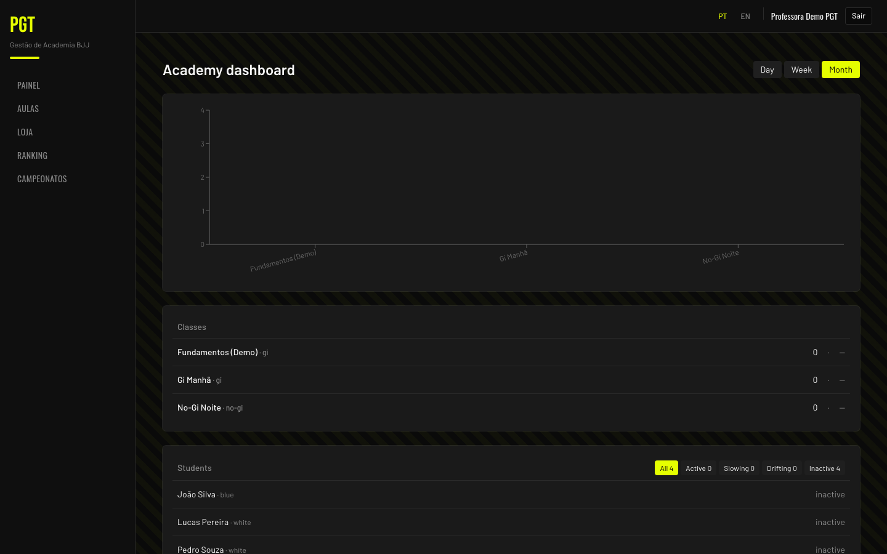

O gráfico de barras mostra o total de check-ins por aula no período. Cada barra é uma aula ativa, da maior para a menor. Passe o mouse (ou toque) sobre uma barra para ver:
<em>The bar chart shows total check-ins per class for the period. Each bar is one active class, highest to lowest. Hover (or tap) a bar to see:</em>

- **Total** — check-ins totais no período
  <em>Total — total check-ins in the period</em>
- **Alunos únicos** — quantos alunos diferentes apareceram
  <em>Alunos únicos (Unique students) — how many distinct students showed up</em>
- **Média/aula** — média de alunos por ocorrência (dia) da aula
  <em>Média/aula (Avg/occurrence) — average students per class occurrence (day)</em>
- **Tendência** — comparação com a média das últimas 4 ocorrências da mesma aula. Ex.: `120%` significa 20% acima da base; `80%` significa 20% abaixo
  <em>Tendência (Trend) — comparison against the average of the last 4 occurrences of the same class. e.g., `120%` means 20% above baseline; `80%` means 20% below</em>

### Lista de Aulas com Tendência
<em>Classes List with Trend</em>

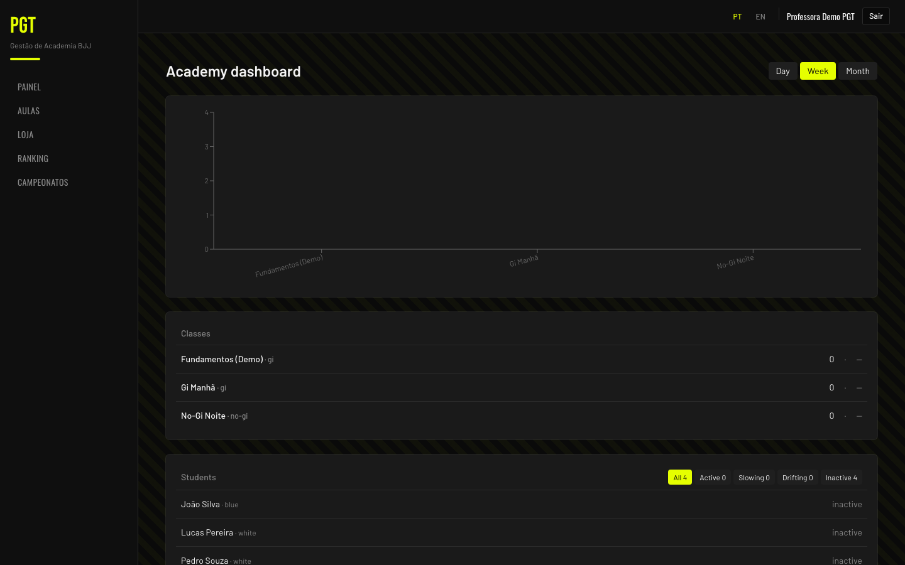

Abaixo do gráfico, cada aula aparece com nome, tipo, horário, total de check-ins e uma **seta de tendência**:
<em>Below the chart, each class appears with name, type, time, total check-ins, and a trend arrow:</em>

- **↑ +N%** (verde) — aderência 10% ou mais acima da média das últimas 4 ocorrências
  <em>↑ +N% (green) — adherence 10% or more above the last-4-occurrence baseline</em>
- **→** (cinza) — aderência dentro da faixa normal (entre -10% e +10%)
  <em>→ (grey) — adherence within normal range (between -10% and +10%)</em>
- **↓ -N%** (vermelho) — aderência 10% ou mais abaixo
  <em>↓ -N% (red) — adherence 10% or more below</em>
- **—** — tendência indisponível (aula com poucas ocorrências anteriores)
  <em>— — trend unavailable (class with too few prior occurrences)</em>

Se a academia tem mais de um tipo de aula, botões de filtro (**Todos**, **Gi**, **No-Gi**, **Open Mat**, **Kids**) aparecem no topo da lista. A lista mostra 10 aulas por página (**Anterior** / **Próximo**).
<em>If the academy has more than one class type, filter buttons (Todos / All, Gi, No-Gi, Open Mat, Kids) appear above the list. The list shows 10 classes per page (Anterior / Próximo — Previous / Next).</em>

Toque em qualquer aula para expandi-la:
<em>Tap any class to expand it:</em>

1. Aparece um mini gráfico de linha com os check-ins por dia nas ocorrências do período
   <em>A mini line chart shows check-ins per day across the period's occurrences</em>
2. Abaixo, a lista **Presentes** da ocorrência mais recente — nome e faixa de cada aluno que fez check-in
   <em>Below it, the Presentes (Roster) list for the most recent occurrence — name and belt of each student who checked in</em>
3. Apenas uma aula fica expandida por vez — toque em outra para trocar, ou na mesma para recolher
   <em>Only one class is expanded at a time — tap another to switch, or the same one to collapse</em>

### Lista de Alunos por Atividade
<em>Students List by Activity</em>

A seção **Alunos** agrupa todos os alunos pelo tempo desde o último check-in. No topo, botões de filtro mostram a contagem de cada grupo:
<em>The Alunos (Students) section groups every student by days since their last check-in. At the top, filter buttons show the count in each group:</em>

| Filtro | Dias desde o último check-in | Cor |
|------|------------------------------|-----|
| **Ativos** | 0 a 6 dias | Verde |
| **Desacelerando** | 7 a 13 dias | Âmbar |
| **Afastando** | 14 a 29 dias | Vermelho |
| **Inativos** | 30 dias ou mais, ou nunca treinou | Cinza |

<em>Ativos (Active): 0–6 days since last check-in (green). Desacelerando (Slowing): 7–13 days (amber). Afastando (Drifting): 14–29 days (red). Inativos (Inactive): 30+ days, or never trained (grey).</em>

Toque em **Todos** para ver todos, ou em outro filtro para filtrar. Toque em um aluno para expandir:
<em>Tap Todos (All) to see everyone, or another filter to narrow down. Tap a student to expand:</em>

- **Total** — total de check-ins do aluno
  <em>Total — student's total check-ins</em>
- **Aulas** — número de aulas diferentes que o aluno frequentou
  <em>Aulas (Classes) — number of distinct classes the student attended</em>
- **Sequência** — semanas consecutivas atuais com ≥ 1 check-in
  <em>Sequência (Streak) — current run of consecutive weeks with ≥ 1 check-in</em>
- **Melhor** — maior sequência já alcançada
  <em>Melhor (Best) — longest streak ever achieved</em>
- Histórico dos últimos 30 dias (data + nome da aula)
  <em>Last 30 days of history (date + class name)</em>

> [!tip] Fluxo de retenção
> Use o filtro **Afastando** como sinal de alerta — são alunos que vinham treinando e pararam há 2–4 semanas. Uma mensagem no WhatsApp nessa janela costuma trazê-los de volta antes de virarem **Inativos**.
> <em>Retention tip: use the Afastando (Drifting) filter as an early-warning list — these are students who were training and stopped 2–4 weeks ago. A WhatsApp message in that window often brings them back before they become Inativos (Inactive).</em>

## Aulas
<em>Classes</em>

A página **Aulas** tem as abas **Quadro de Aulas** (um calendário com as visões **Mês**, **Semana**, **Dia** e **Agenda**, e os botões **Hoje**, **Anterior** e **Próximo**) e **Histórico de Presença**.
<em>The Aulas (Classes) page has the Quadro de Aulas (Class Schedule) tab — a calendar with Mês / Semana / Dia / Agenda (Month / Week / Day / Agenda) views and Hoje / Anterior / Próximo (Today / Back / Next) buttons — and the Histórico de Presença (Attendance History) tab.</em>

### Criar uma Aula
<em>Create a Class</em>

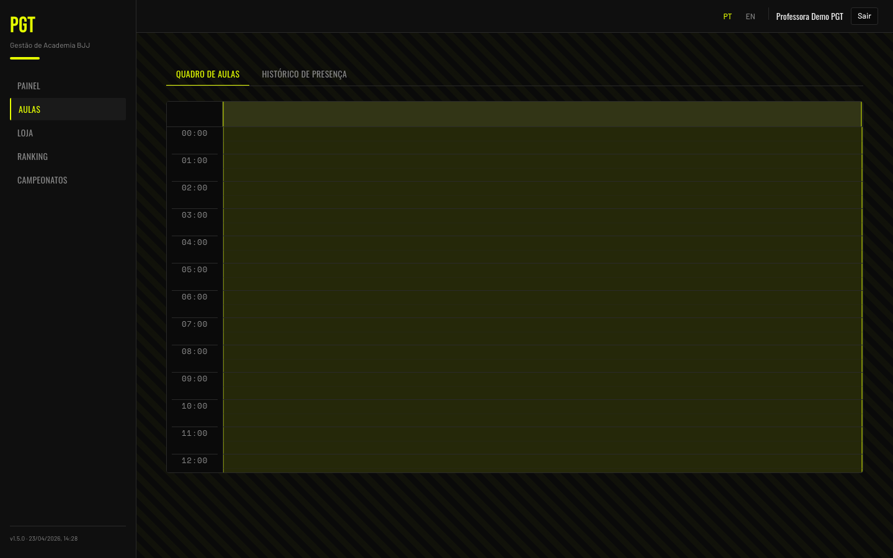

1. Menu → **Aulas**
   <em>Menu → Aulas (Classes)</em>
2. Toque em **"Criar Aula"**
   <em>Tap "Criar Aula" (Create Class)</em>
3. Preencha **Nome da Aula**, **Tipo** (Gi / No-Gi / Open Mat / Kids), **Dias da Semana** (toque em um ou mais dias), **Horário Início** e **Horário Fim**
   <em>Fill in Nome da Aula (Class Name), Tipo (Type: Gi / No-Gi / Open Mat / Kids), Dias da Semana (Days of the Week — tap one or more days), Horário Início (Start Time), and Horário Fim (End Time)</em>
4. Toque em **"Salvar"** — é criada uma aula semanal para cada dia escolhido
   <em>Tap "Salvar" (Save) — one weekly class is created for each day you picked</em>

### Editar, Mover ou Excluir uma Aula
<em>Edit, Move, or Delete a Class</em>

- Toque em uma aula no calendário para abrir **"Editar Aula"**; altere nome, tipo, dia da semana ou horários e toque em **"Salvar"**
  <em>Tap a class on the calendar to open "Editar Aula" (Edit Class); change name, type, day of the week, or times, and tap "Salvar" (Save)</em>
- Para mudar o horário rapidamente, arraste a aula para outro dia/horário no calendário ("Aula reagendada")
  <em>To reschedule quickly, drag the class to another day/time on the calendar ("Aula reagendada" — Class rescheduled)</em>
- Para excluir, no mesmo diálogo toque em **"Excluir Aula"** e confirme em **"Excluir Aula"** novamente. Os check-ins antigos são preservados
  <em>To delete, in the same dialog tap "Excluir Aula" (Delete Class) and confirm with "Excluir Aula" again. Past check-ins are kept</em>

### Histórico de Presença
<em>Attendance History</em>

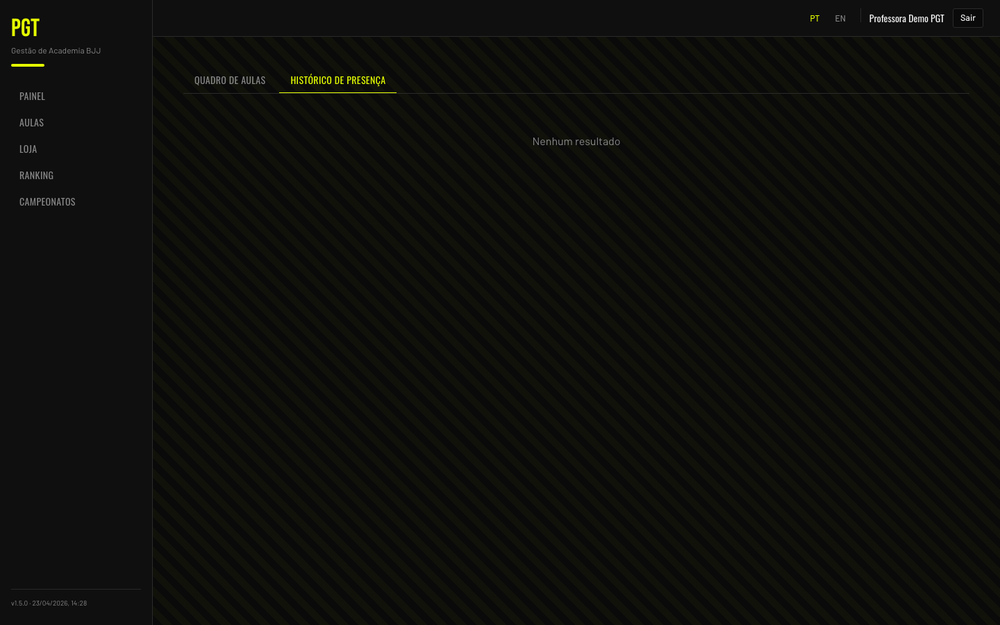

Menu → **Aulas** → aba **Histórico de Presença** lista os check-ins **da sua própria conta** (data, aula e tipo). Para ver a presença dos alunos, use o [Painel da Academia](#Painel%20da%20Academia).
<em>Menu → Aulas → Histórico de Presença tab lists your own account's check-ins (date, class, and type). To see student attendance, use the Academy Dashboard.</em>

## Sistema de Check-in
<em>Check-in System</em>

Os alunos podem fazer check-in nas aulas de duas formas:
<em>Students can check in to classes two ways:</em>

### Método 1: Botão de Proximidade
<em>Method 1: Proximity Button</em>

O aluno toca em **"Check-in"** na aula, no celular. O sistema verifica se ele está a menos de 250 metros da academia (GPS) e se a aula está acontecendo (de 15 min antes do início até 1 hora depois do fim).
<em>The student taps "Check-in" on the class, on their phone. The system verifies they're within 250 meters of your gym (GPS) and that the class is happening (from 15 min before the start until 1 hour after the end).</em>

### Método 2: Totem com QR Code
<em>Method 2: QR Code Totem</em>

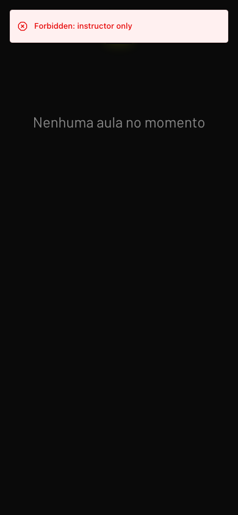

O totem de QR Code transforma qualquer tablet em uma estação de check-in.
<em>The QR code totem turns any tablet into a check-in station.</em>

1. Num tablet na entrada da academia, entre com a sua conta e abra Menu → **Totem** (ou o endereço `/totem`)
   <em>On a tablet at your gym entrance, log in with your account and open Menu → Totem (Kiosk) (or the `/totem` address)</em>
2. A página mostra os QR Codes de todas as aulas que estão acontecendo; fora do horário aparece "Nenhuma aula no momento"
   <em>The page shows QR codes for all classes currently happening; outside class times it shows "Nenhuma aula no momento" (No classes right now)</em>
3. Os códigos são atualizados a cada **4 minutos**
   <em>Codes refresh every 4 minutes</em>
4. Os alunos escaneiam com a câmera do celular (ou pelo botão central de check-in do app) → o check-in é concluído automaticamente
   <em>Students scan with their phone camera (or with the app's center check-in button) → check-in completes automatically</em>
5. Para sair do totem, toque em **"Voltar"**
   <em>To leave the totem, tap "Voltar" (Back)</em>

> [!tip]
> Deixe a página do totem aberta o dia todo. Ela detecta automaticamente quais aulas estão ativas com base no horário.
> <em>Leave the totem page open all day. It auto-detects which classes are active based on the schedule.</em>

## Financeiro
<em>Billing</em>

A página **Financeiro** tem as abas **Inadimplentes** e **Pagamentos**. O valor de cada aluno vem da **Mensalidade** definida na página dele (veja [Definir a Mensalidade](#Definir%20a%20Mensalidade)).
<em>The Financeiro (Billing) page has the Inadimplentes (Overdue Payments) and Pagamentos (Payments) tabs. Each student's amount comes from the Monthly Fee set on their page (see Set the Monthly Fee).</em>

### Registrar um Pagamento
<em>Record a Payment</em>

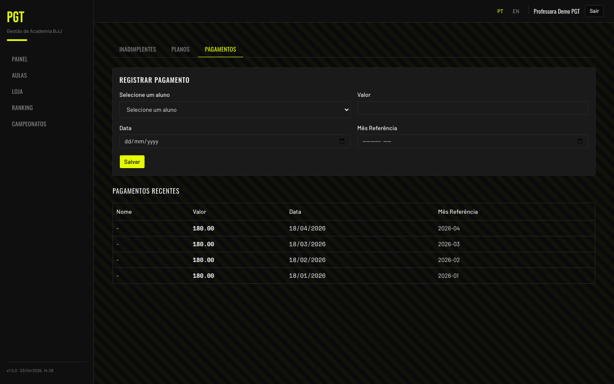

1. Menu → **Financeiro** → aba **Pagamentos**
   <em>Menu → Financeiro → Pagamentos (Payments) tab</em>
2. O formulário **"Registrar Pagamento"** já aparece no topo da página
   <em>The "Registrar Pagamento" (Record Payment) form is already shown at the top of the page</em>
3. Em **"Selecione um aluno"**, digite o nome e escolha o aluno na lista — o **Valor** é preenchido com a mensalidade dele
   <em>In "Selecione um aluno" (Select a student), type the name and pick the student from the list — Valor (Amount) is filled in with their Monthly Fee</em>
4. Confira o **Valor**, a **Data** (hoje, por padrão) e o **Mês Referência** (mês atual, por padrão — qual mês o pagamento cobre)
   <em>Check the Valor (Amount), the Data (Date — today by default), and the Mês Referência (Reference Month — current month by default; which month the payment covers)</em>
5. Toque em **"Salvar"**
   <em>Tap "Salvar" (Save)</em>
6. Os pagamentos registrados aparecem em **"Pagamentos Recentes"**, abaixo do formulário
   <em>Recorded payments appear under "Pagamentos Recentes" (Recent Payments), below the form</em>

### Acompanhar Inadimplentes
<em>Track Overdue Payments</em>

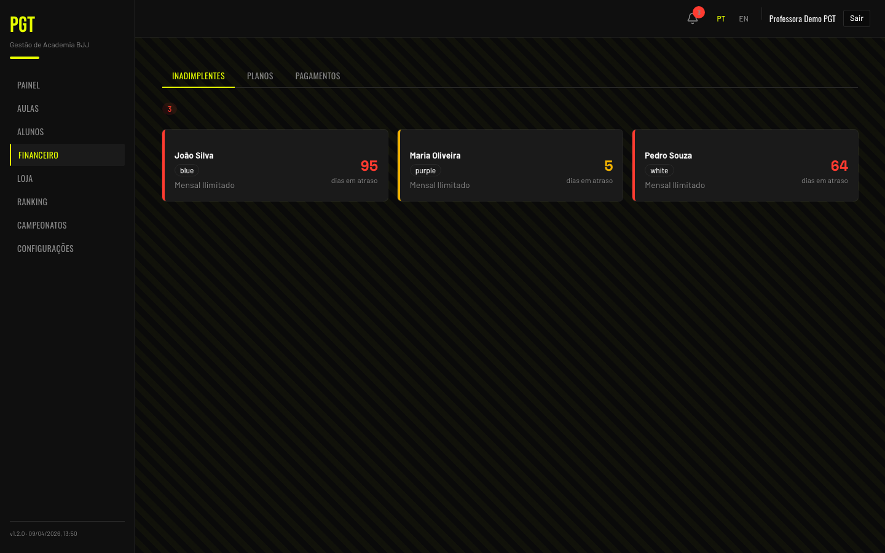

1. Menu → **Financeiro** (a aba **Inadimplentes** abre primeiro)
   <em>Menu → Financeiro (the Inadimplentes tab opens first)</em>
2. Aparecem os alunos com meses não pagos após o dia de vencimento (meses isentos não contam) e o total ("N inadimplentes")
   <em>Students with unpaid months past their due day are listed (waived months don't count), with a total ("N inadimplentes" — N overdue)</em>
3. Cada cartão mostra os meses em aberto, o valor devido e os dias de atraso. A borda é amarela (menos de 8 dias de atraso) ou vermelha (8 dias ou mais)
   <em>Each card shows the unpaid months, the amount due, and the days overdue. The border is yellow (less than 8 days late) or red (8 or more days late)</em>
4. Alunos de uma mesma família aparecem juntos em **um cartão de família** (veja abaixo), sem repetir cada membro
   <em>Students of the same family show together in one family card (see below), without repeating each member</em>

Em cada cartão de aluno:
<em>On each student card:</em>

- **"Registrar Pagamento"** — pagamento rápido: registra na hora o **mês atual** com o valor da mensalidade do aluno
  <em>"Registrar Pagamento" (Record Payment) — quick pay: immediately records the current month at the student's Monthly Fee</em>
- **WhatsApp** — abre uma conversa com o aluno (só aparece se ele tiver telefone)
  <em>WhatsApp — opens a chat with the student (only shown when they have a phone number)</em>

> [!note]
> O pagamento rápido cobre só o mês atual. Para pagar um mês anterior, use a aba **Pagamentos** e escolha o **Mês Referência**.
> <em>Quick pay covers only the current month. To pay an earlier month, use the Pagamentos tab and pick the Mês Referência (Reference Month).</em>

### Pagamento da Família
<em>Family Payment</em>

Um cartão de família tem o selo **"Família"**, o nome da família, os membros, os meses em aberto, o total e os dias de atraso. A família fica na lista enquanto algum membro dever um mês não isento.
<em>A family card has the "Família" (Family) badge, the family name, members, unpaid months, total, and days overdue. The family stays on the list while any member owes a non-waived month.</em>

- **WhatsApp** — abre a conversa com o **Contato da família** ou, se não houver, com o primeiro membro que tiver telefone
  <em>WhatsApp — opens a chat with the Family Contact or, if none, with the first member who has a phone</em>
- **"Registrar pagamento da família"** — abre o diálogo **Pagamento da família**
  <em>"Registrar pagamento da família" (Record family payment) — opens the Pagamento da família (Family payment) dialog</em>

Um **Pagamento da família** quita meses inteiros de todos os membros de uma vez (nunca parte de um mês).
<em>A Family Payment settles whole months for every member at once (never part of a month).</em>

1. Em **"Meses a pagar"**, todos os meses em aberto já vêm marcados. Cada mês mostra o valor da família e a situação de cada membro: **em aberto**, **pago**, **isento** ou **sem mensalidade**. Desmarque os meses que não estão sendo pagos agora
   <em>Under "Meses a pagar" (Months to pay), every unpaid month is already ticked. Each month shows the family amount and each member's status: em aberto (owed), pago (paid), isento (waived), or sem mensalidade (no monthly fee). Untick the months not being paid now</em>
2. O **Valor** acompanha os meses marcados (preço acordado da família, ou a soma das mensalidades). Você pode digitar outro valor — por exemplo, o que a família realmente transferiu
   <em>The Valor (Amount) follows the ticked months (family agreed price, or the sum of the Monthly Fees). You can type a different amount — e.g., what the family actually transferred</em>
3. Confira a **Data** (hoje, por padrão) e toque em **"Registrar pagamento"**
   <em>Check the Data (Date — today by default) and tap "Registrar pagamento" (Record payment)</em>

O pagamento aparece no histórico de cada membro, dividido proporcionalmente às mensalidades; só o total da família é exato. Os avisos de pagamento dos membros somem.
<em>The payment shows in each member's history, split in proportion to their Monthly Fees; only the family total is exact. The members' payment banners clear.</em>

> [!note] Mês pago em parte
> Um membro pode pagar sozinho (pagamento individual). Então a família mostra aquele mês como **"X de Y pagos"**. Ao registrar o pagamento da família, só os membros ainda em aberto são cobrados — mas o valor sugerido é o do mês inteiro, então ajuste o **Valor** para o que falta.
> <em>A member can pay alone (individual payment). The family then shows that month as "X de Y pagos" (X of Y paid). When you record the family payment, only the members still owing are charged — but the suggested amount is the whole month's, so adjust the Valor (Amount) to what is left.</em>

## Notificações
<em>Notifications</em>

### Sino de Notificações
<em>Notification Bell</em>

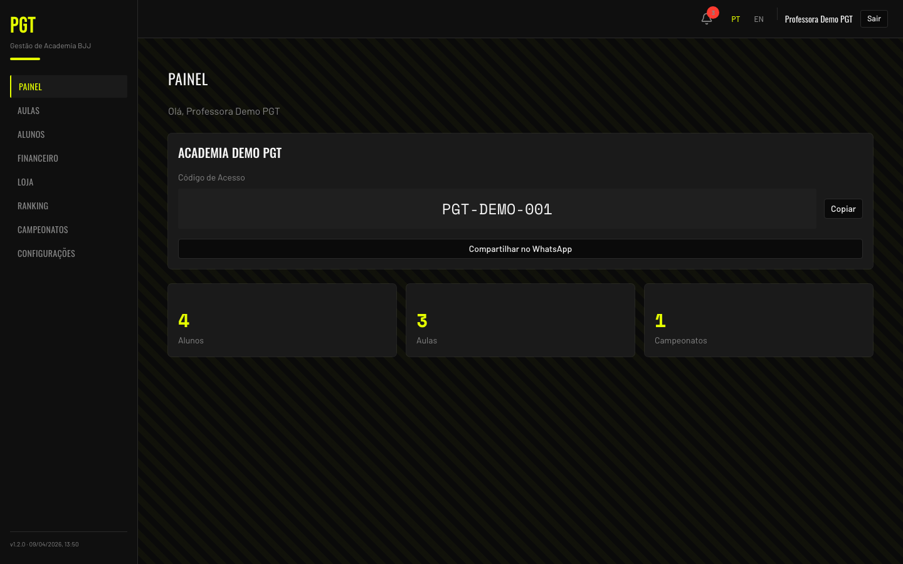

O ícone de sino no cabeçalho exibe um número vermelho com a quantidade de inadimplentes **não silenciados** (alunos e famílias). O sino aparece em todas as páginas.
<em>The bell icon in the header shows a red badge with the count of unmuted overdue items (students and families). The bell appears on every page.</em>

Toque no sino para ver cada inadimplente com o valor devido e os dias de atraso. Para cada **aluno** você pode:
<em>Tap the bell to see each overdue item with amount due and days overdue. For each student you can:</em>

- **Enviar lembrete** — abre o WhatsApp com uma mensagem de cobrança pré-preenchida (só aparece se houver telefone)
  <em>Enviar lembrete (Send reminder) — opens WhatsApp with a pre-filled payment reminder (only shown when there's a phone number)</em>
- **Enviar email** — envia um e-mail de cobrança; o botão muda para **"Email enviado"** e fica desativado
  <em>Enviar email (Send email) — sends a payment reminder email; the button changes to "Email enviado" (Email sent) and disables</em>
- **Silenciar** (ícone de sino riscado, sem texto) — tira o aluno da lista de notificações
  <em>Mute (crossed-out bell icon, no text label) — removes the student from the notification list</em>

Para uma **família**, só há **Enviar lembrete** (WhatsApp para o contato da família ou o primeiro membro com telefone).
<em>For a family, there's only Enviar lembrete (WhatsApp to the family contact or the first member with a phone).</em>

### Silenciar um Aluno
<em>Mute a Student</em>

Se um aluno tiver um acordo especial (ex.: ajuda a limpar a academia em troca de desconto), toque no ícone de **sino riscado** ao lado dele no sino de notificações. Ele sai do número e da lista do sino na hora (continua aparecendo em **Financeiro → Inadimplentes**).
<em>If a student has a special arrangement (e.g., helping clean the gym in exchange for a discount), tap the crossed-out bell icon next to them in the notification bell. They leave the bell's count and list immediately (they still show under Financeiro → Inadimplentes).</em>

> [!tip]
> Se o aluno simplesmente não deve aquele mês (não treinou, lesão, férias), prefira um [Mês isento](#Meses%20Isentos) em vez de silenciar.
> <em>If the student simply doesn't owe that month (didn't train, injury, holidays), prefer a Waived Month over muting.</em>

## Loja
<em>Marketplace</em>

### Adicionar e Editar Produtos
<em>Add and Edit Products</em>

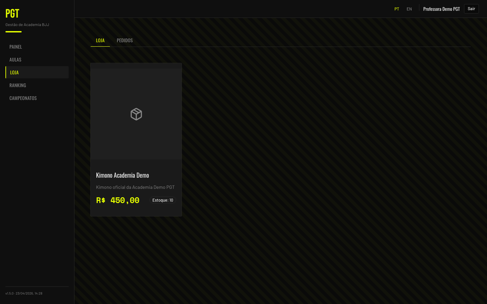

1. Menu → **Loja** (a aba **LOJA** já estará ativa)
   <em>Menu → Loja (Marketplace) — the LOJA (Store) tab is already active</em>
2. Toque em **"Adicionar Produto"**
   <em>Tap "Adicionar Produto" (Add Product)</em>
3. Preencha **Nome do Produto**, **Descrição**, **Preço** e **Estoque**
   <em>Fill in Nome do Produto (Product Name), Descrição (Description), Preço (Price), and Estoque (Stock)</em>
4. Toque em **"Salvar"**
   <em>Tap "Salvar" (Save)</em>

Em cada produto, **"Editar"** abre o mesmo formulário e **"Excluir"** remove o produto após a confirmação ("Excluir … da loja?").
<em>On each product, "Editar" (Edit) opens the same form and "Excluir" (Delete) removes the product after confirmation ("Remove … from the shop?").</em>

### Gerenciar Pedidos
<em>Manage Orders</em>

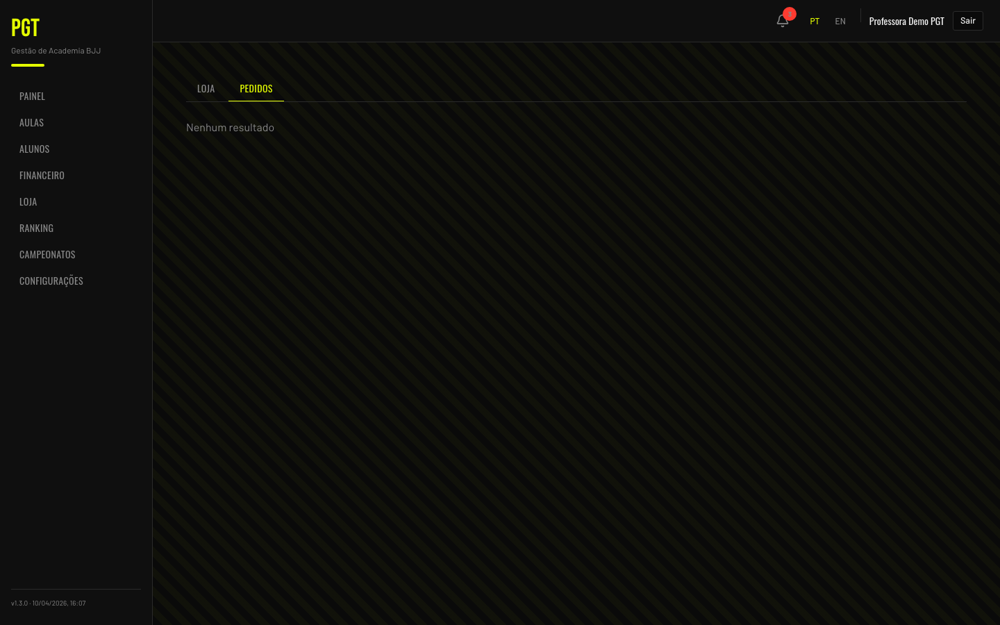

1. Menu → **Loja** → aba **PEDIDOS**
   <em>Menu → Loja → PEDIDOS (Orders) tab</em>
2. Veja os pedidos dos alunos com status: **Solicitado**, **Confirmado**, **Entregue** ou **Cancelado**
   <em>See student orders with status: Solicitado (Requested), Confirmado (Confirmed), Entregue (Delivered), or Cancelado (Cancelled)</em>
3. Para pedidos **Solicitados**: toque em **"Confirmar"** para aceitar ou **"Cancelar"** para recusar (confirme em **"Cancelar pedido"**)
   <em>For Solicitado orders: tap "Confirmar" (Confirm) to accept or "Cancelar" (Cancel) to decline (confirm with "Cancelar pedido" — Cancel order)</em>
4. Para pedidos **Confirmados**: toque em **"Entregar"** para marcar como entregue
   <em>For Confirmado orders: tap "Entregar" (Deliver) to mark as delivered</em>

## Gamificação
<em>Gamification</em>

A página **Ranking** tem as abas **Classificação**, **Temporadas** e **Resultados**.
<em>The Ranking page has the Classificação (Leaderboard), Temporadas (Seasons), and Resultados (Results) tabs.</em>

### Criar uma Temporada
<em>Create a Season</em>

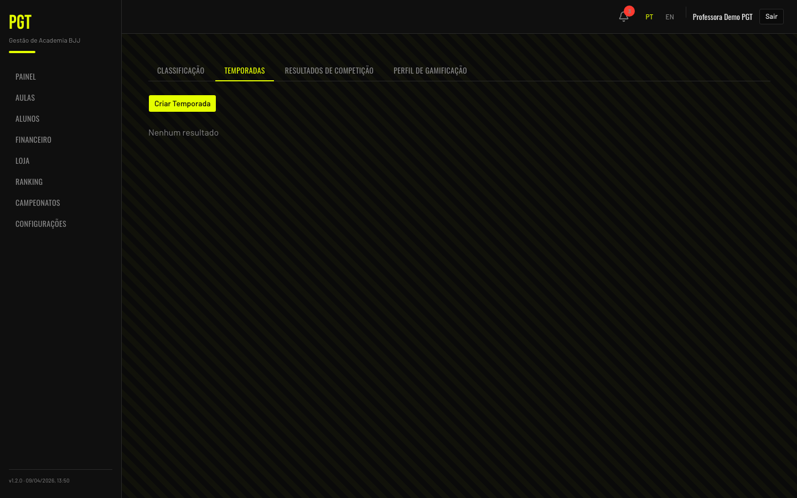

1. Menu → **Ranking** → aba **Temporadas**
   <em>Menu → Ranking → Temporadas tab</em>
2. Toque em **"Criar Temporada"**
   <em>Tap "Criar Temporada" (Create Season)</em>
3. Defina **Nome da Temporada**, **Data Início**, **Data Fim**, **Premiação** (opcional) e a **Pontuação (1º / 2º / 3º)**
   <em>Set Nome da Temporada (Season Name), Data Início (Start Date), Data Fim (End Date), Premiação (Prize, optional), and Pontuação (1º / 2º / 3º) (Points for 1st / 2nd / 3rd)</em>
4. Toque em **"Criar"** para salvar
   <em>Tap "Criar" (Create) to save</em>

### Aprovar Resultados de Competição
<em>Approve Competition Results</em>

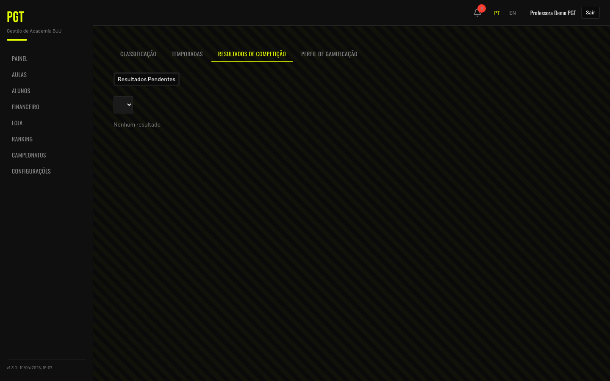

Quando os alunos enviam resultados, você os analisa.
<em>When students submit results, you review them.</em>

1. Menu → **Ranking** → aba **Resultados**
   <em>Menu → Ranking → Resultados (Results) tab</em>
2. Em **Resultados Pendentes**, escolha a temporada no seletor
   <em>Under Resultados Pendentes (Pending Results), pick the season in the selector</em>
3. Cada resultado mostra aluno, competição, data, colocação e pontos
   <em>Each result shows student, competition, date, placement, and points</em>
4. Toque em **"Aprovar"** para conceder os pontos ou **"Rejeitar"** para recusar
   <em>Tap "Aprovar" (Approve) to award the points or "Rejeitar" (Reject) to decline</em>

### Registrar um Resultado
<em>Register a Result</em>

Para registrar você mesmo um campeonato de um aluno (ex.: ele contou na academia):
<em>To register a student's championship yourself (e.g. they told you at the academy):</em>

1. Menu → **Ranking** → aba **Resultados** → **"Registrar resultado"**
   <em>Menu → Ranking → Resultados (Results) tab → "Registrar resultado" (Register result)</em>
2. Busque o **Aluno** pelo nome, preencha **Competição**, **Data da competição** e a **Colocação** (1º / 2º / 3º)
   <em>Search the **Aluno** (student) by name, fill in **Competição** (competition), **Data da competição** (date) and **Colocação** (placement: 1st / 2nd / 3rd)</em>
3. Toque em **"Registrar"** — o resultado já entra **aprovado**, com pontos no ranking e XP para o aluno
   <em>Tap **"Registrar"** — the result is **approved** right away, with ranking points and XP for the student</em>

> Toda academia começa com a temporada **"Ranking <ano>"** (1º = 10, 2º = 7, 3º = 5 pts). A temporada de cada resultado é escolhida pela data da competição.
> <em>Every academy starts with a "Ranking <year>" season (1st = 10, 2nd = 7, 3rd = 5 pts). Each result's season is picked from the competition date.</em>

### Ver o Ranking
<em>View Leaderboard</em>

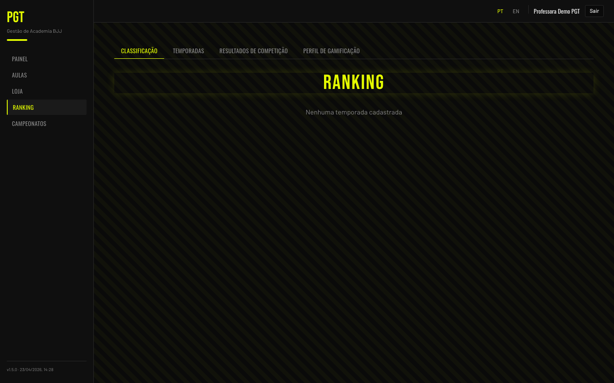

Menu → **Ranking** → aba **Classificação**. Escolha a temporada, a categoria (**Adultos** / **Kids**) e, em Adultos, a faixa (**Todas as faixas** / Branca / Azul / Roxa / Marrom / Preta).
<em>Menu → Ranking → Classificação (Leaderboard) tab. Pick the season, the category (Adultos / Kids — Adults / Kids) and, for adults, the belt (Todas as faixas / All belts, White, Blue, Purple, Brown, Black).</em>

## Campeonatos
<em>Tournaments</em>

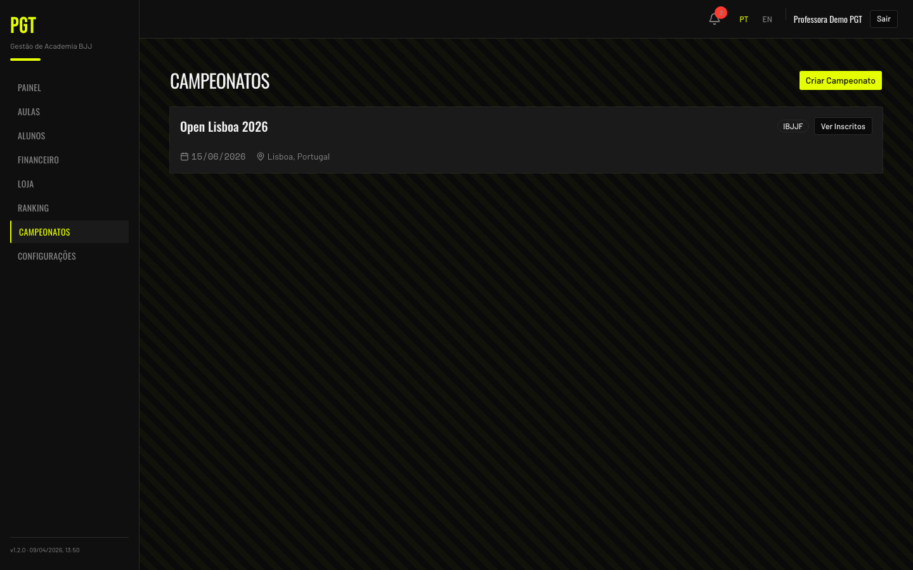

1. Menu → **Campeonatos**
   <em>Menu → Campeonatos (Tournaments)</em>
2. Toque em **"Criar Campeonato"**, preencha **Nome do Campeonato**, **Data**, **Local** e **Federação** e toque em **"Criar"**
   <em>Tap "Criar Campeonato" (Create Tournament), fill in Nome do Campeonato (Tournament Name), Data (Date), Local (Location), and Federação (Federation), and tap "Criar" (Create)</em>
3. Para ver os inscritos, toque em **"Ver Inscritos"** em qualquer campeonato — a lista abre com nome, faixa e categoria de peso
   <em>To see participants, tap "Ver Inscritos" (View Roster) on any tournament — the list opens with name, belt, and weight class</em>
4. Os alunos se inscrevem por conta própria, informando a categoria de peso
   <em>Students sign up themselves, entering their weight class</em>

## Dicas
<em>Tips</em>

- **Defina a localização da academia primeiro** — os check-ins por proximidade não funcionam sem ela
  <em>Set the gym location first — proximity check-ins won't work without it</em>
- **Defina a mensalidade de cada aluno** — aluno sem mensalidade não é cobrado nem aparece nos inadimplentes
  <em>Set each student's Monthly Fee — a student without one isn't billed and never shows as overdue</em>
- **Revise as Possíveis famílias** — é o jeito mais rápido de montar as famílias
  <em>Review Possible Families — it's the quickest way to set up families</em>
- **Deixe o totem aberto em um tablet** — é o método de check-in mais fácil para os alunos
  <em>Leave the totem open on a tablet — it's the easiest check-in method for students</em>
- **Use lembretes pelo WhatsApp** — os alunos respondem muito mais rápido do que por e-mail
  <em>Use WhatsApp reminders — students respond much faster than to email</em>
- **O sino de notificações** — seu fluxo diário de cobrança fica aqui
  <em>The notification bell — your daily payment-management workflow lives here</em>
