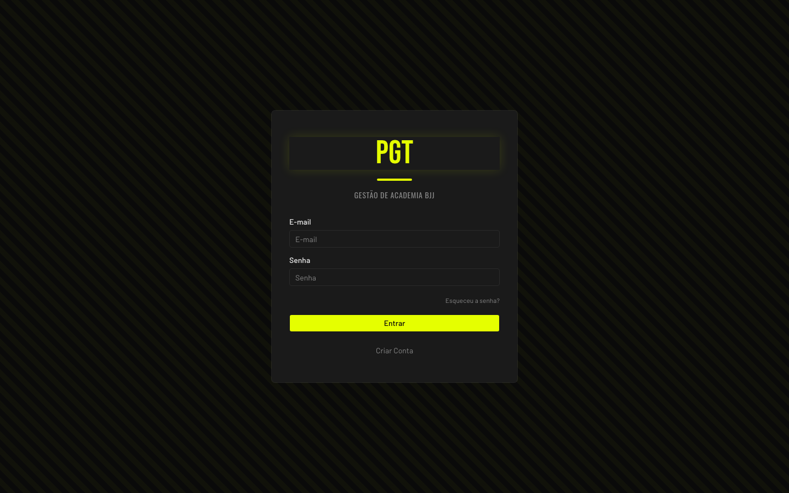
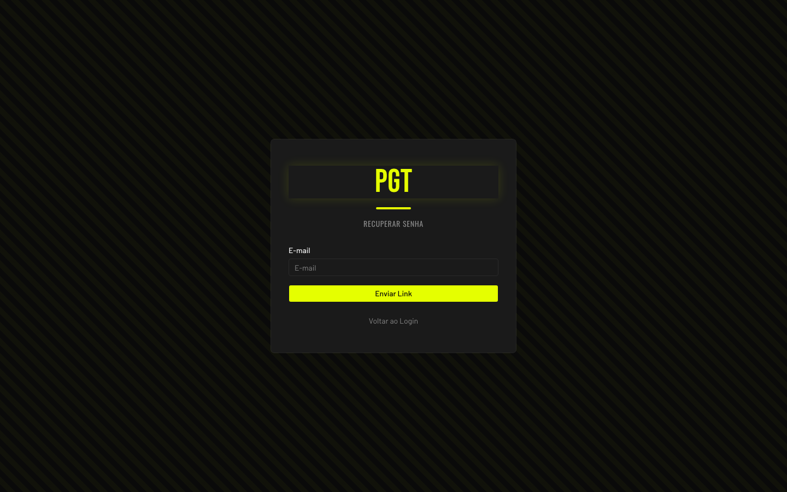
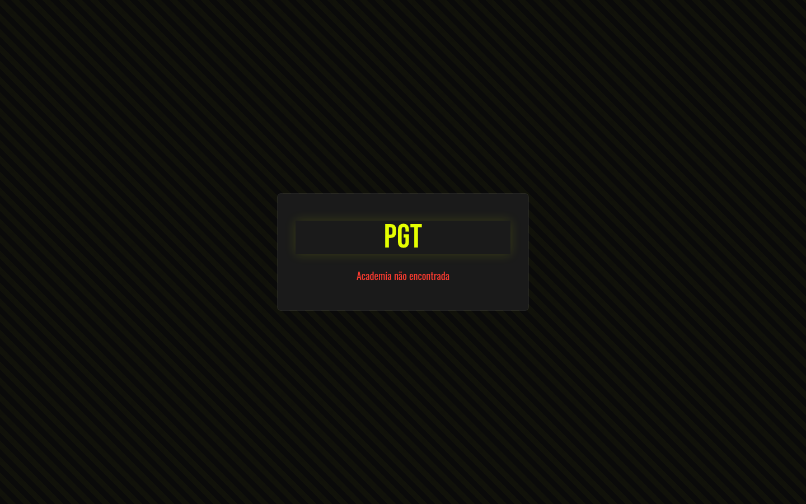
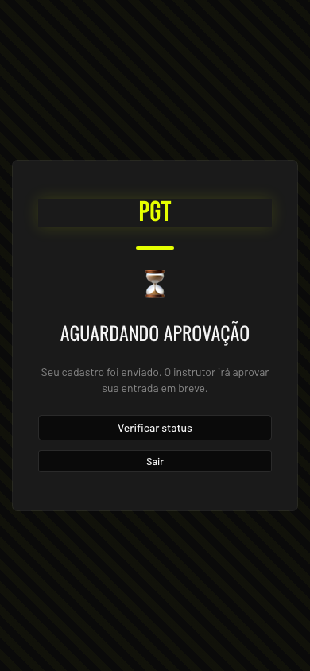
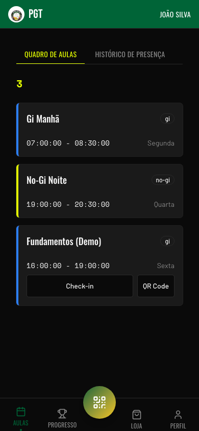
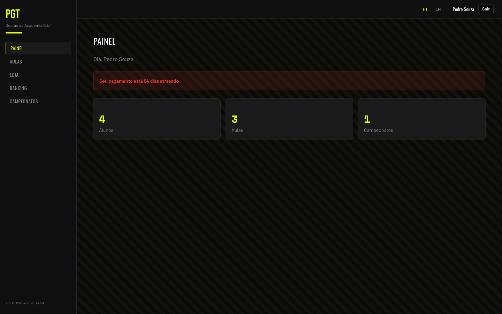
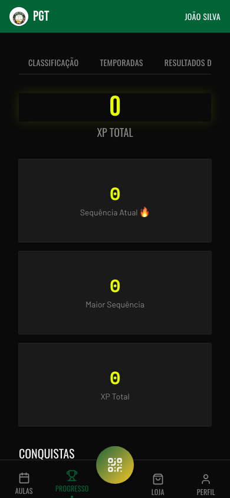
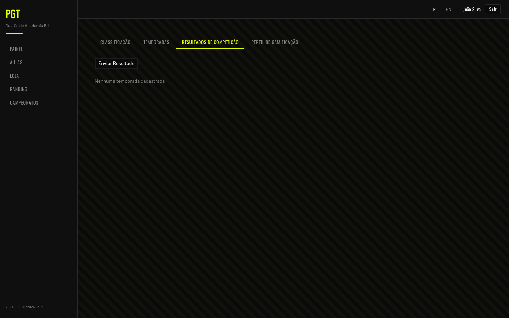
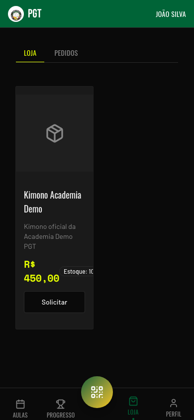
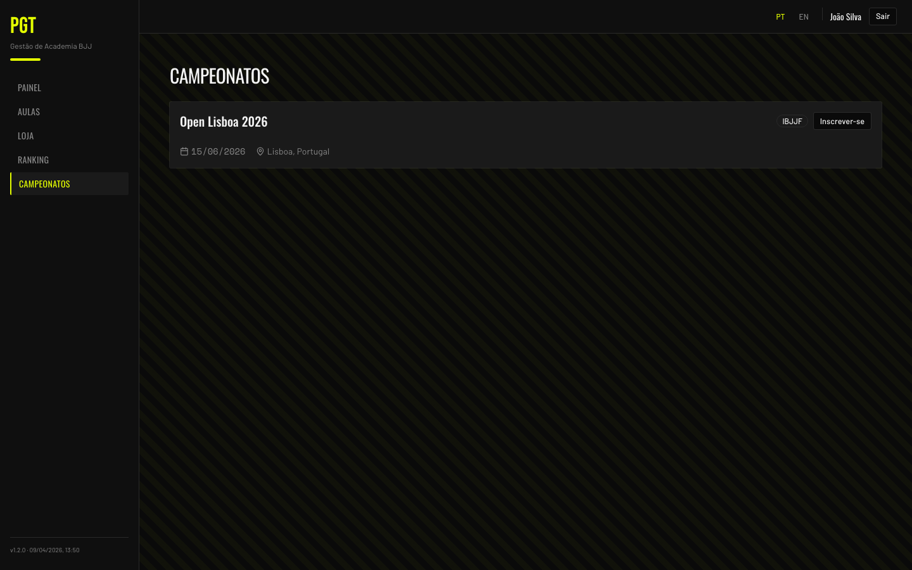

# Guia do Aluno
<em>Student Guide</em>

Tudo o que você precisa saber para usar o PGT e acompanhar seu treino de BJJ.
<em>Everything you need to know about using PGT to track your BJJ training.</em>

> [!info] Guias relacionados
> - [Guia do Instrutor](./User%20Guide%20-%20Instructor.md)

## Primeiros Passos
<em>Getting Started</em>

### Fazer Login
<em>Log In</em>

Acesse o PGT pelo navegador e faça login com seu e-mail e senha.
<em>Open PGT in your browser and log in with your email and password.</em>

1. Na tela de login, preencha **E-mail** e **Senha**
   <em>On the login screen, enter your **Email** and **Password**</em>
2. Toque em **"Entrar"**
   <em>Tap **"Entrar"**</em>

Caso ainda não tenha conta, toque em **"Criar Conta"** para se cadastrar.
<em>If you don't have an account yet, tap **"Criar Conta"** to sign up.</em>

### Recuperar Senha
<em>Recover Password</em>

Se você esqueceu sua senha:
<em>If you forgot your password:</em>

1. Na tela de login, toque em **"Esqueceu a senha?"**
   <em>On the login screen, tap **"Esqueceu a senha?"**</em>
2. Digite seu e-mail e toque em **"Enviar Link"**
   <em>Enter your email and tap **"Enviar Link"**</em>
3. Você receberá um e-mail com o link de redefinição — toque nele
   <em>You'll receive a recovery email — tap the link in it</em>
4. Na tela **"Redefinir Senha"**, digite a nova senha, confirme e toque em **"Redefinir"**
   <em>On the **"Redefinir Senha"** screen, enter your new password, confirm it, and tap **"Redefinir"**</em>

> [!note] Link de expiração
> O link de redefinição expira após um curto período. Se você ver "Link inválido ou expirado", toque em **"Solicitar novo link"** para receber outro.
> <em>The reset link expires after a short time. If you see "Link inválido ou expirado", tap **"Solicitar novo link"** to receive a new one.</em>

### Entrar em uma Academia
<em>Join Your Academy</em>

Você precisa de um código de acesso do seu instrutor (ex.: `PGT-PONTINHA-CM7`).
<em>You need a join code from your instructor (e.g., `PGT-PONTINHA-CM7`).</em>

1. Vá ao aplicativo e toque em **"Criar Conta"**
   <em>Go to the app and tap **"Criar Conta"**</em>
2. Escolha **"Tenho um código"** e digite o código que seu instrutor enviou
   <em>Choose **"Tenho um código"** and enter the code your instructor sent you</em>
3. Toque em **"Continuar"** — o sistema identifica sua academia
   <em>Tap **"Continuar"** — the system identifies your academy</em>
4. Preencha seus dados: **Nome**, **E-mail**, **Senha** e **Faixa**
   <em>Fill in your details: **Nome** (name), **Email**, **Senha** (password), and **Faixa** (belt)</em>

> [!note] Opções de faixa
> As faixas aparecem em inglês no formulário: White, Blue, Purple, Brown, Black.
> <em>Belt options appear in English on the form: White, Blue, Purple, Brown, Black.</em>

5. Toque em **"Continuar"** para enviar o cadastro
   <em>Tap **"Continuar"** to submit your registration</em>

### Aguardar Aprovação
<em>Wait for Approval</em>

Após o cadastro, seu status é **Pendente**. Seu instrutor precisa aprová-lo antes que você possa acessar as aulas. Você verá uma tela de espera com o botão **"Verificar status"** até lá.
<em>After signing up, your status is Pending. Your instructor needs to approve you before you can access classes. You'll see a waiting screen with a **"Verificar status"** button until then.</em>

Para sair durante a espera, toque em **"Sair"**.
<em>To sign out while waiting, tap **"Sair"**.</em>

## Instalar o PGT como aplicativo
<em>Install PGT as an app</em>

Você pode instalar o PGT na tela inicial do seu celular e usá-lo como um aplicativo nativo, sem abrir o navegador.
<em>You can install PGT on your phone's home screen and use it like a native app, without opening a browser.</em>

### iPhone (Safari)
1. Abra o PGT no **Safari** (não funciona em outros navegadores no iPhone).
   <em>Open PGT in **Safari** (it won't work in other browsers on iPhone).</em>
2. Toque no botão de **compartilhar** na barra inferior.
   <em>Tap the **share** button in the bottom bar.</em>
3. Escolha **"Adicionar à Tela de Início"**.
   <em>Choose **"Add to Home Screen"**.</em>
4. Confirme o nome e toque em **Adicionar**.
   <em>Confirm the name and tap **Add**.</em>

### Android (Chrome)
1. Abra o PGT no **Chrome**.
   <em>Open PGT in **Chrome**.</em>
2. Toque no menu (três pontinhos) no canto superior direito.
   <em>Tap the menu (three dots) in the top right.</em>
3. Escolha **"Instalar app"** ou **"Adicionar à tela inicial"**.
   <em>Choose **"Install app"** or **"Add to home screen"**.</em>

## Navegando no app
<em>Navigating the app</em>

A navegação principal fica na barra inferior, sempre visível.
<em>The main navigation lives in the bottom bar, always visible.</em>

- **Aulas** — sua agenda e histórico de presenças.
  <em>**Classes** — your schedule and attendance history.</em>
- **Progresso** — faixas, graus, conquistas e ranking.
  <em>**Progress** — belts, stripes, achievements, and ranking.</em>
- **Check-in (botão central verde)** — abre o leitor de QR code em tela cheia.
  <em>**Check-in (center green button)** — opens the QR code scanner full-screen.</em>
- **Loja** — produtos da academia.
  <em>**Shop** — academy products.</em>
- **Perfil** — mensalidade, torneios, idioma, tema, sair.
  <em>**Me** — membership, tournaments, language, theme, sign out.</em>

## Fazer Check-in nas Aulas
<em>Checking In to Classes</em>

Você pode fazer check-in de duas formas. Ambas são igualmente válidas.
<em>You can check in two ways. Both are equally valid.</em>

### Método 1: Tocar no Botão de Check-in
<em>Method 1: Tap the Check-in Button</em>

1. Barra inferior → **Aulas**
   <em>Bottom nav → Classes</em>
2. Para qualquer aula ativa no momento, você verá dois botões: **"Check-in"** e **"QR Code"**
   <em>For any class that's currently active, you'll see two buttons: **"Check-in"** and **"QR Code"**</em>
3. Toque em qualquer um dos dois — ambos usam GPS para verificar sua presença
   <em>Tap either button — both use GPS to verify your presence</em>
4. Seu celular solicitará permissão de localização — aprove
   <em>Your phone will ask for location permission — approve it</em>
5. O sistema verifica se você está na academia (dentro de 250m) e registra sua presença
   <em>The system verifies you're at the gym (within 250m) and logs your attendance</em>

> [!warning] Você precisa estar fisicamente na academia
> O sistema usa o GPS do seu celular. Se você não estiver dentro de 250 metros da academia, o check-in será recusado.
> <em>You must be physically at the gym. The system uses your phone's GPS. If you're not within 250 meters of the gym, the check-in is rejected.</em>

Após o check-in, o botão é substituído por **"Presente"**.
<em>After checking in, the button is replaced by **"Presente"**.</em>

### Método 2: Escanear o QR Code do Totem
<em>Method 2: Scan the Totem QR Code</em>

Se sua academia tiver um tablet na entrada exibindo QR Codes:
<em>If your gym has a tablet at the entrance showing QR codes:</em>

Aponte a câmera do celular para o QR Code do totem na academia. O navegador abre automaticamente a página de check-in e confirma sua presença.
<em>Point your phone camera at the totem QR code at the academy. The browser automatically opens the check-in page and confirms your attendance.</em>

### Regras de Check-in
<em>Check-in Rules</em>

- Você só pode fazer check-in em uma aula **uma vez por dia**
  <em>You can only check in to a class once per day</em>
- A aula precisa estar **acontecendo no momento** (15 min antes até 1 hora após o horário programado)
  <em>The class must be currently happening (15 min before to 1 hour after the scheduled time)</em>
- Você não pode fazer check-in em duas aulas que começam no mesmo horário
  <em>You can't check in to two classes that start at the same time</em>
- Se você esqueceu de fazer check-in, peça ao seu instrutor — ele pode registrá-lo manualmente
  <em>If you forgot to check in, ask your instructor — they can record it manually</em>

### Ver Seu Histórico de Check-ins
<em>View Your Check-in History</em>

Barra inferior → **Aulas** → aba **Histórico de Presença**. Veja todos os seus check-ins anteriores com data, nome da aula e tipo.
<em>Bottom nav → Classes → **Histórico de Presença** tab. See all your past check-ins with date, class name, and type.</em>

## Check-in rápido
<em>Quick check-in</em>

Toque no grande botão verde no centro da barra inferior para abrir o leitor de QR code. Aponte a câmera para o QR code na entrada da sua academia para marcar presença.
<em>Tap the large green button in the center of the bottom bar to open the QR code scanner. Point your camera at the QR code at your academy's entrance to check in.</em>

## Pagamentos
<em>Payments</em>

### Banners de Pagamento
<em>Payment Banners</em>

Ao fazer login, o painel exibe um banner se:
<em>When you log in, the dashboard shows a banner if:</em>

- **Seu pagamento está próximo do vencimento**: banner azul (cor primária)
  <em>Your payment is due soon: blue (primary) banner</em>
- **Seu pagamento está em atraso**: banner vermelho mostrando quantos dias de atraso
  <em>Your payment is overdue: red banner showing how many days late</em>

### Histórico de Pagamentos
<em>Payment History</em>

Os pagamentos são registrados pelo seu instrutor. Para ver seu histórico, peça ao instrutor para consultá-lo na tela de detalhes do seu perfil — ele verá data, valor e o mês de referência de cada pagamento.
<em>Payments are recorded by your instructor. To see your payment history, ask your instructor to look it up in your student detail screen — they will see the date, amount, and reference month for each payment.</em>

> [!note] Você não pode pagar pelo aplicativo
> O aplicativo apenas registra pagamentos. Pague ao seu instrutor da forma que vocês combinarem (dinheiro, transferência, etc.) — ele registrará no sistema.
> <em>You can't pay through the app. The app only tracks payments. Pay your instructor however you normally do (cash, transfer, etc.) — they'll record it in the system.</em>

## Minha conta
<em>My account</em>

A aba **Perfil** reúne tudo que é seu.
<em>The **Me** tab gathers everything that's yours.</em>

- **Mensalidade** — status do pagamento.
  <em>**Membership** — payment status.</em>
- **Torneios** — inscrições e resultados.
  <em>**Tournaments** — registrations and results.</em>
- **Idioma** — alternar entre Português e Inglês.
  <em>**Language** — switch between Portuguese and English.</em>
- **Tema** — claro, escuro ou automático.
  <em>**Theme** — light, dark, or automatic.</em>
- **Configurações** — dados pessoais e segurança.
  <em>**Settings** — personal details and security.</em>
- **Sair** — encerra a sessão neste dispositivo.
  <em>**Sign out** — ends the session on this device.</em>

## Gamificação
<em>Gamification</em>

### Seu Perfil
<em>Your Profile</em>

Barra inferior → **Progresso** → aba **Perfil de Gamificação**. Veja:
<em>Bottom nav → Progress → **Perfil de Gamificação** tab. See your:</em>

- Total de XP
  <em>Total XP</em>
- Sequência atual (semanas consecutivas de treino)
  <em>Current streak (consecutive weeks of training)</em>
- Maior sequência
  <em>Longest streak</em>
- Conquistas obtidas
  <em>Badges earned</em>

### Enviar Resultados de Competição
<em>Submit Competition Results</em>

Quando você competir em um campeonato, envie seu resultado para ganhar pontos.
<em>When you compete in a tournament, submit your result for points.</em>

1. Barra inferior → **Progresso** → aba **Resultados de Competição**
   <em>Bottom nav → Progress → **Resultados de Competição** tab</em>
2. Toque em **"Enviar Resultado"**
   <em>Tap **"Enviar Resultado"**</em>
3. Preencha o formulário:
   <em>Fill in the form:</em>
   - **Temporadas**: selecione a temporada ativa
     <em>**Temporadas**: select the active season</em>
   - **Nome da Competição**: nome do campeonato
     <em>**Nome da Competição**: tournament name</em>
   - **Data**: data em que o campeonato ocorreu
     <em>**Data**: date the tournament took place</em>
   - **Colocação**: toque em **"1º Lugar"**, **"2º Lugar"** ou **"3º Lugar"**
     <em>**Colocação**: tap **"1º Lugar"**, **"2º Lugar"**, or **"3º Lugar"**</em>
4. Toque em **"Salvar"** — seu instrutor irá revisar e aprovar
   <em>Tap **"Salvar"** — your instructor will review and approve it</em>

### Ranking
<em>Leaderboard</em>

Barra inferior → **Progresso** → aba **Classificação**. Veja onde você se posiciona em relação aos outros alunos. Filtre por categoria (**Adultos** / **Kids**) e por nível de faixa.
<em>Bottom nav → Progress → **Classificação** tab. See where you rank against other students. Filter by category (**Adultos** / **Kids**) and by belt level.</em>

## Loja
<em>Marketplace</em>

### Explorar Produtos
<em>Browse Products</em>

Barra inferior → **Loja**. Veja quimonos, equipamentos e outros itens que sua academia vende.
<em>Bottom nav → Shop. See gear, kimonos, and other items your academy sells.</em>

### Fazer um Pedido
<em>Place an Order</em>

1. Na tela **Loja**, cada produto tem um botão **"Solicitar"** — toque nele diretamente
   <em>On the **Loja** screen, each product card has a **"Solicitar"** button — tap it directly</em>
2. Seu instrutor recebe o pedido e o prepara
   <em>Your instructor receives the order and prepares it</em>
3. Acompanhe o status na aba **Pedidos**
   <em>Track status under the **Pedidos** tab</em>

## Campeonatos
<em>Tournaments</em>

### Inscrever-se em um Evento
<em>Sign Up for an Event</em>

1. Barra inferior → **Perfil** → **Torneios**
   <em>Bottom nav → Me → Tournaments</em>
2. Encontre o campeonato que deseja participar
   <em>Find the tournament you want to attend</em>
3. Toque em **"Inscrever-se"** e selecione sua **Categoria de Peso**
   <em>Tap **"Inscrever-se"** and select your **Categoria de Peso** (weight class)</em>
4. Toque em **"Confirmar"** — você aparecerá na lista de inscritos
   <em>Tap **"Confirmar"** — you'll appear on the roster</em>

## Dicas
<em>Tips</em>

- **Instale o PGT na tela inicial** — acesse sem abrir o navegador a cada vez
  <em>Install PGT on your home screen — open it without launching a browser each time</em>
- **Permita o acesso à localização** quando solicitado — necessário para check-ins por proximidade
  <em>Allow location access when prompted — required for proximity check-ins</em>
- **Faça check-in toda vez que treinar** — isso aumenta sua sequência e XP
  <em>Check in every time you train — it builds your streak and XP</em>
- **Envie resultados de competições** — seja reconhecido no ranking
  <em>Submit competition results — get recognized on the leaderboard</em>
- **Fique atento aos lembretes de pagamento** — o banner vermelho avisa quando o pagamento está em atraso
  <em>Watch for payment reminders — the red banner tells you when payment is overdue</em>
